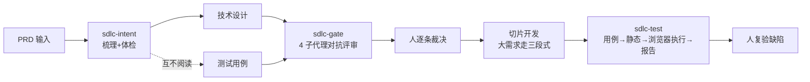

# claude-sdlc-skills

[](https://skills.sh/TsCarpe/claude-sdlc-skills)

**AI-native SDLC skills for Claude Code** (and other coding agents via [skills.sh](https://skills.sh)): five battle-tested skills that let AI take over the repetitive labor of requirement intake, review, testing and release auditing — while humans stay in charge at a few hard gates. Built and validated end-to-end on a real production Java project (a 57-issue review gate run, 74 test cases through browser execution). Docs are in Chinese; skills trigger on both Chinese and English phrases.

一套在真实 Java 项目跑通的 AI 原生 SDLC（软件开发生命周期）技能集：AI 承担梳理、评审、测试、审计的重复劳动，人只在关键关口裁决。不是玩具——每个 skill 都经过多轮真实需求迭代与官方 best-practices 复核。

---

## 这是怎么运转的

一个需求的典型旅程（完整方法论见 [docs/workflow.md](docs/workflow.md)）：



旁路随时可用：sdlc-doubt（对刚做的决策发起对抗式复查）、sdlc-config-review（发版前扫描配置 Key）。

## 安装

**方式一：skills CLI（npx 一行装，推荐）**

```bash
npx skills add TsCarpe/claude-sdlc-skills        # 装到当前项目 .claude/skills/
npx skills add TsCarpe/claude-sdlc-skills -g     # 装到全局 ~/.claude/skills/
```

**方式二：Claude Code 插件市场**

```
/plugin marketplace add TsCarpe/claude-sdlc-skills
/plugin install claude-sdlc-skills@claude-sdlc-skills
```

**装完先试这个**（零外部依赖）：对一个真实需求文档（飞书链接或本地 markdown）说——

> 帮我梳理这个需求文档 <链接或路径>，完成后继续体检

## Skill 矩阵

| skill | 一句话职责 | 触发例句 | 输入 | 产物 | 外部依赖 |
|---|---|---|---|---|---|
| [sdlc-intent](skills/sdlc-intent/SKILL.md) | 需求两段式接收：梳理成结构化共识 → 六层缺陷体检 | 「帮我梳理这个需求文档…完成后继续体检」 | PRD（飞书/本地文件） | `sdlc/<需求名>/req/` 三件套（digest/audit/pm-checklist） | 无必需（lark-cli 飞书集成可选） |
| [sdlc-gate](skills/sdlc-gate/SKILL.md) | 评审关口：设计与用例并行独立产出后，4 个全新上下文子代理互查，人工逐条裁决 | 「/sdlc-gate <需求名>」「评审关口」 | design.md + cases.md | `review/issues-<日期>.md` 宽表 | 无硬依赖（mysql MCP 只读核对可选） |
| [sdlc-test](skills/sdlc-test/SKILL.md) | AI 测试四阶段：用例生成 → 静态比对 → 浏览器执行 → 报告，两道人工关卡 | 「/sdlc-test cases <需求名>」「AI 测试」 | req 三件套 + test 环境 | cases.md + reports/ | chrome-devtools/mysql/codegraph MCP（各带降级） |
| [sdlc-doubt](skills/sdlc-doubt/SKILL.md) | 对刚做出的非平凡决策发起对抗式复查：剥离结论，交全新上下文找问题 | 「这个判断我不放心，帮我质疑一下」 | 决策（代码 diff/design 片段/SQL） | 会话内五步闭环结论 | 无 |
| [sdlc-config-review](skills/sdlc-config-review/SKILL.md) | 发版前扫描分支 diff，提取需要配置中心注入的 Key 清单 | 「梳理上线配置清单」 | git diff | Apollo/Nacos 新增 Key 清单 | 无（git 即可） |

## 渐进采用阶梯

不必一步到位，按依赖重量逐级上（详细论证见 [docs/workflow.md §7.3](docs/workflow.md)）：

1. **sdlc-intent**（5 分钟）——零依赖，需求梳理+体检立即可用
2. **sdlc-config-review**（5 分钟）——零 MCP，任意 git 仓库即用
3. **sdlc-doubt**（观念转变）——关键决策落定前多一道对抗复查
4. **sdlc-gate**（1 天上手）——需要先有「设计+用例并行产出」的习惯，收益最大
5. **sdlc-test**（持续投入）——需要 test 环境 + MCP 工具面配套，建议 ①-④ 稳定后再上

## 一个需求的一生

6 步走查（每步附真实产物片段）：[docs/example-walkthrough.md](docs/example-walkthrough.md)

| 步 | 谁做 | 产物 |
|---|---|---|
| 1 需求梳理+体检 | sdlc-intent → 人确认口径 | req/ 三件套 |
| 2 大需求规划 | 人逐行核对（确认点①②） | prd/design（[三段式](docs/large-req-playbook.md)） |
| 3 设计与用例并行 | AI 两条独立路径 | design.md + cases.md |
| 4 评审关口 | sdlc-gate → **人逐条裁决** | issues 宽表 |
| 5 AI 测试 | sdlc-test → **人过两道关卡** | cases + reports |
| 6 收尾沉淀 | 归档 + 教训回写 | 规范增量 |

## 大需求自顶向下拆分（流程方法论）

功能点 ≥5 / 涉及表结构变更 / 跨业务域的大需求不整块开发：第一段业务全貌（角色×状态×功能点主线串联）→ 第二段技术骨架（接口契约分级 / D 表八类别 / 公共资产六类）→ 第三段骨架 child 先行、逐功能点切片。三次小确认替代一次看不完的大确认。

- 规则全文：[docs/large-req-playbook.md](docs/large-req-playbook.md)（框架无关，任意任务框架可复刻）
- 产物模板：[templates/](templates/)（stage1 业务全貌 / stage2 技术骨架 / stage3 child prd）

## 适用边界

- **sdlc-test** 按「Java 后端 + MySQL + Element Plus 系前端」打磨；其他栈可用但交互姿势手册需自行沉淀
- **sdlc-intent** 的飞书/评论区集成是可选增强，本地 markdown 输入完全等价
- **sdlc-gate** 的前提是设计与用例**独立产出**（用例不读设计）——用例读过设计时交叉审查退化为一致性检查，产物中会如实标注
- 单人开发即可用 intent/doubt/config-review；gate/test 在有两份产物、有 test 环境时收益最大
- 所有 skill 对 MCP 依赖均声明降级行为，缺失不炸（降级矩阵见 [docs/faq.md](docs/faq.md)）

## Roadmap

- [ ] sdlc-flow：三段式引导 skill（把 playbook 机制化为流程编排）
- [ ] examples/：完整脱敏样例需求产物目录
- [ ] sdlc-doc / sdlc-yapi：技术设计文档与接口文档同步（飞书/YApi 生态，视需求拆出）
- [ ] 英文文档

## 致谢

站在这些来源的肩膀上：[addyosmani/agent-skills](https://github.com/addyosmani/agent-skills)（纪律强制）、[Claude Agent Skills 官方最佳实践](https://platform.claude.com/docs/zh-CN/agents-and-tools/agent-skills/best-practices)（skill 工程规范）、[AI-Native SDLC Playbook](https://academy.claude.com/zh-CN/courses/ai-native-sdlc-playbook)（工件链思想）。

## License

[MIT](LICENSE)

版本兼容：已在 Claude Code + skills CLI（2026-09 版）验证；skill 遵循 Agent Skills 开放标准，其他兼容 agent（Cursor 等）经 skills.sh 亦可安装。
