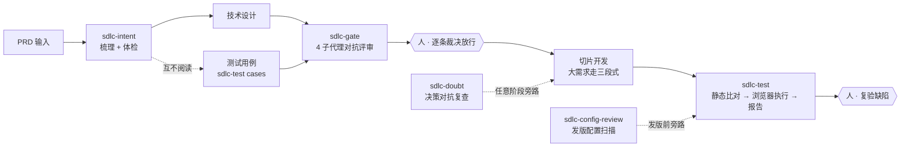

# claude-sdlc-skills

[](https://skills.sh/TsCarpe/claude-sdlc-skills)
[](https://github.com/TsCarpe/claude-sdlc-skills/actions/workflows/validate.yml)
[](LICENSE)

**AI-native SDLC skills for Claude Code** (and other coding agents via [skills.sh](https://skills.sh)) — AI takes over the repetitive labor of requirement intake, test design, adversarial review, browser testing and release auditing; humans rule only at a few hard gates. Battle-tested end-to-end on a real production Java project. Docs in Chinese; skills trigger on Chinese and English phrases.

把 SDLC 里最耗人的重复劳动——需求梳理、测试用例、评审、浏览器测试、发版审计——交给 AI；红线由脚本机械拦截；**人只在关口裁决**。不是 prompt 合集，是带关卡、留档、降级路径的完整工作流。

```bash
npx skills add TsCarpe/claude-sdlc-skills   # 一行安装，先跑 sdlc-intent 零依赖
```

---

## 为什么是这套

AI 写代码已经够快，瓶颈移到了**需求理解、测试与评审**：这些环节要么仍靠人工硬扛，要么让 AI 自由发挥但不可信。本仓库的答案是三条纪律：

1. **产物落盘，不靠对话记忆**——每个环节产出 markdown 文件（digest / cases / issues / report），跨会话可恢复、可逐行核对、可审计
2. **对抗出真问题**——评审与决策复查用全新上下文的子代理扇出互查，独立推导的设计与用例交叉比对，分歧即信号
3. **服从的事走代码，判断的事走人**——红线（关卡、命名、规范违规）由 hook/脚本机械拦截，不打扰；口径冲突、issue 裁决、放行全部留给真人

来自源项目（某 Java DDD 生产系统）的实测数字：**57 条**评审 issue 单轮关口产出（12 分歧 + 45 角色问题）、**74 条**用例走完浏览器执行、回归轮 **0 agent token**（用例资产化为 Playwright spec 后由 runner 跑）、6 个 skill 对齐官方 [best-practices](https://platform.claude.com/docs/zh-CN/agents-and-tools/agent-skills/best-practices)（5 个经多轮复核，sdlc-guardrails 按同标准新增）。

## 一个需求怎么走



六边形 = 人工关口，只有两处；旁路机制随时可插。带真实产物片段的 6 步走查见 [example-walkthrough](docs/example-walkthrough.md)。

## Skill 矩阵（6 个）

| skill | 阶段 | 触发示例 | 产物 | 依赖 |
|---|---|---|---|---|
| [sdlc-intent](skills/sdlc-intent/SKILL.md) | 需求进来时 | 「帮我梳理这个需求文档，完成后继续体检」 | `intake/` 三件套：digest（结构化共识）/ audit（六层缺陷体检）/ pm-checklist | 无必需 |
| [sdlc-test](skills/sdlc-test/SKILL.md) | 用例与测试期 | `/sdlc-test cases\|static\|exec\|spec\|report <需求名>` | cases.md（用例+缺陷权威文件）+ 各轮 reports；通过用例可资产化为 Playwright spec | chrome-devtools / mysql / codegraph MCP（均带降级） |
| [sdlc-gate](skills/sdlc-gate/SKILL.md) | 设计+用例定稿后 | `/sdlc-gate <需求名>` | issues 宽表（原文摘引+裁决列），放行后解锁开发与测试执行 | 无硬依赖 |
| [sdlc-doubt](skills/sdlc-doubt/SKILL.md) | 旁路 · 任意阶段 | 「这个判断我不放心，帮我质疑一下」 | 会话内五步闭环（CLAIM→EXTRACT→DOUBT→RECONCILE→STOP） | 无 |
| [sdlc-config-review](skills/sdlc-config-review/SKILL.md) | 旁路 · 发版前 | 「梳理上线配置清单」 | 配置 Key 清单 + xxl-job 任务/MQ 订阅平台操作清单 + 知会项 | git 即可 |
| [sdlc-guardrails](skills/sdlc-guardrails/SKILL.md) | 横切 · 写入瞬间 | 「给这个项目接红线拦截」 | hook 拦截（guardrails.yaml 四类规则）+ pre-commit 兜底 + `--check` 基线报告 | python3 |

关键机制：**关卡互认**（sdlc-gate 放行视同 sdlc-test 关卡1 通过）、**用例独立性红线**（cases 禁止读设计——交叉审查的价值前提）、**降级不炸**（任一 MCP 缺失都有声明过的降级路径，见 [faq](docs/faq.md)）。

## 快速开始

**方式一：skills CLI（推荐）**

```bash
npx skills add TsCarpe/claude-sdlc-skills        # 装到当前项目 .claude/skills/
npx skills add TsCarpe/claude-sdlc-skills -g     # 装到全局 ~/.claude/skills/
```

**方式二：Claude Code 插件市场**

```
/plugin marketplace add TsCarpe/claude-sdlc-skills
/plugin install claude-sdlc-skills@claude-sdlc-skills
```

**装完先试这个**（零外部依赖）：对一个真实需求文档（飞书链接或本地 markdown）说——

> 帮我梳理这个需求文档 <链接或路径>，完成后继续体检

装完只是开始：sdlc-guardrails 红线拦截、回归 runner、测试环境文件在项目侧怎么搭，见 [docs/project-setup.md](docs/project-setup.md)。

## 渐进采用阶梯

不必一步到位，按依赖重量逐级上（论证见 [workflow.md §7.3](docs/workflow.md)）：

1. **sdlc-intent**（5 分钟）——零依赖，梳理+体检立即可用
2. **sdlc-config-review**（5 分钟）——零 MCP，任意 git 仓库即用
3. **sdlc-doubt**（观念转变）——关键决策落定前多一道对抗复查
4. **sdlc-gate**（1 天上手）——需要先有「设计+用例并行产出」的习惯，收益最大
5. **sdlc-test**（持续投入）——需要 test 环境 + MCP 配套，建议 ①-④ 稳定后再上
6. **sdlc-guardrails**（10 分钟）——改一次项目 settings.json + 写规则文件，红线从文档变机械拦截

## 大需求三段式拆分

功能点 ≥5 / 涉及表结构变更 / 跨业务域的大需求不整块开发：**第一段业务全貌**（角色×状态×功能点主线串联）→ **第二段技术骨架**（接口契约分级 / D 表八类别 / 公共资产六类）→ **第三段骨架 child 先行、逐功能点切片**——三次小确认替代一次看不完的大确认。

- 方法论全文：[docs/large-req-playbook.md](docs/large-req-playbook.md)（框架无关，任意任务框架可复刻）+ 三份 [产物模板](templates/)
- 全流程叙述：[docs/workflow.md](docs/workflow.md) · 理论依据：[docs/ai-native-sdlc-guide.md](docs/ai-native-sdlc-guide.md)

## 文档导航

全部文档带[导读地图](docs/README.md)与三条阅读路径：

- **上手用**（30 分钟）：README → [example-walkthrough](docs/example-walkthrough.md)（看产物长什么样）→ [faq](docs/faq.md)
- **理解方法论**（2 小时）：[workflow](docs/workflow.md) → [ai-native-sdlc-guide](docs/ai-native-sdlc-guide.md)（业界理论）→ [agent-stack-mental-model](docs/design/agent-stack-mental-model.md)（skill 还是 hook 的判断框架）
- **接入与改造**（按需）：[project-setup](docs/project-setup.md)（项目侧配什么）→ [sdlc-test-design](docs/sdlc-test-design.md)（D1-D21 决策）→ [dev-standards-reference](docs/dev-standards-reference/README.md)（给自己的项目搭规范底座）→ [sdlc-guardrails](skills/sdlc-guardrails/README.md)（红线引擎）

## 适用边界（诚实版）

- **sdlc-intent** 的飞书/评论区集成是可选增强，本地 markdown 输入完全等价
- **sdlc-test** 方法论栈无关，按「Java 后端 + MySQL + Element Plus 系前端」预置姿势；其他栈按 [stack-profile](skills/sdlc-test/references/stack-profile.md) 五面清单接入
- **sdlc-gate** 的前提是设计与用例**独立产出**（用例不读设计）——读过则交叉审查退化为一致性检查，产物中会如实标注
- 单人开发即可用 intent / doubt / config-review；gate / test 在有两份产物、有 test 环境时收益最大
- 强制层（hook 拦截）建成时间尚短，未经大量真实任务检验（[热力图自评](docs/design/sdlc-workflow-landscape.md)）

## Roadmap

- [ ] sdlc-flow：三段式引导 skill（把 playbook 机制化为流程编排）
- [ ] examples/：完整脱敏样例需求产物目录
- [ ] sdlc-doc / sdlc-yapi：技术设计文档与接口文档同步（飞书/YApi 生态，视需求拆出）
- [ ] 英文文档

## 致谢

站在这些来源的肩膀上：[addyosmani/agent-skills](https://github.com/addyosmani/agent-skills)（纪律强制）、[Claude Agent Skills 官方最佳实践](https://platform.claude.com/docs/zh-CN/agents-and-tools/agent-skills/best-practices)（skill 工程规范）、[AI-Native SDLC Playbook](https://academy.claude.com/zh-CN/courses/ai-native-sdlc-playbook)（工件链思想）。

## License

[MIT](LICENSE) · 版本兼容：已在 Claude Code + skills CLI（2026-09 版）验证；skill 遵循 Agent Skills 开放标准，其他兼容 agent（Cursor 等）经 skills.sh 亦可安装。更新日志：[CHANGELOG.md](CHANGELOG.md)（最新 v0.4.0）

## Community

感谢 LINUX DO 社区的讨论与反馈：<https://linux.do>
