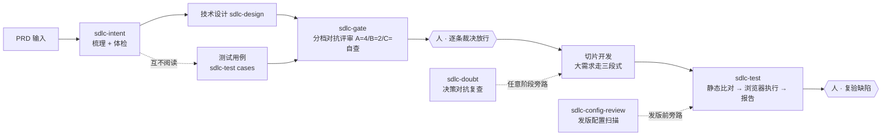

# claude-sdlc-skills

[](https://skills.sh/TsCarpe/claude-sdlc-skills)
[](https://github.com/TsCarpe/claude-sdlc-skills/actions/workflows/validate.yml)
[](LICENSE)

**AI-native SDLC skills for Claude Code**（其他兼容 agent 经 [skills.sh](https://skills.sh) 亦可安装）——把 SDLC 里最耗人的重复劳动交给 AI：需求梳理、技术设计、测试用例与浏览器执行、对抗评审、发版审计；红线由脚本机械拦截；**人只在两处关口裁决**。不是 prompt 合集，是带关卡、留档、降级路径的完整工作流。

文档以中文为主，skill 对中英文触发语均响应；在真实 Java 项目上端到端跑通后开源。

```bash
npx skills add TsCarpe/claude-sdlc-skills   # 一行安装；sdlc-intent 零依赖，装完 5 分钟可试
```

---

## 为什么需要它

AI 写代码已经够快，瓶颈移到了**需求理解、测试与评审**——这些环节要么仍靠人工硬扛，要么让 AI 自由发挥但不可信。这套 skills 用三条纪律回答：

1. **产物落盘，不靠对话记忆**——每个环节产出 markdown 文件（digest / design / cases / issues / report），跨会话可恢复、可逐行核对、可审计
2. **对抗出真问题**——评审与决策复查交给全新上下文的子代理独立推导、交叉比对，分歧即信号
3. **服从的事走代码，判断的事走人**——红线（关卡、命名、规范违规）由 hook/脚本机械拦截，不打扰；口径冲突、issue 裁决、放行全部留给真人

## 一个需求的一生


```mermaid
flowchart LR
    A[PRD 输入] --> B[sdlc-intent<br/>梳理 + 体检]
    B --> C1[技术设计 sdlc-design]
    B -.互不阅读.-> C2[测试用例<br/>sdlc-test cases]
    C1 --> D[sdlc-gate<br/>分档对抗评审 A=4/B=2/C=自查]
    C2 --> D
    D --> E{{人 · 逐条裁决放行}}
    E --> F[切片开发<br/>大需求走三段式]
    F --> G[sdlc-test<br/>静态比对 → 浏览器执行 → 报告]
    G --> H{{人 · 复验缺陷}}
    DB[sdlc-doubt<br/>决策对抗复查] -. 任意阶段旁路 .-> F
    CR[sdlc-config-review<br/>发版配置扫描] -. 发版前旁路 .-> G
```

六边形 = 人工关口，只有两处；旁路机制随时可插。带真实产物片段的 6 步走查见 [example-walkthrough](docs/example-walkthrough.md)。

## 8 个 skill 一览

| skill | 阶段 | 干什么 · 触发示例 |
|---|---|---|
| [sdlc-intent](skills/sdlc-intent/SKILL.md) | 需求进来时 | 梳理 PRD 成结构化 digest（角色/概念/功能地图/流程/状态机），再按七层缺陷体检产出分级 issue 报告 + PM 澄清清单。「帮我梳理这个需求文档，完成后继续体检」 |
| [sdlc-design](skills/sdlc-design/SKILL.md) | 设计期 | digest 确认后产 design.md：备选方案 / 接口契约读写分级 / 公共资产归属 / D 表（C 约束·H 假设）/ 实施切分约束。`/sdlc-design <需求名>` |
| [sdlc-test](skills/sdlc-test/SKILL.md) | 用例与测试期 | 用例生成 → 静态代码一致性比对 → test 环境浏览器执行 → 报告；通过用例资产化为 Playwright spec，回归交给 runner。`/sdlc-test cases\|dev\|static\|exec\|spec\|report <需求名>` |
| [sdlc-gate](skills/sdlc-gate/SKILL.md) | 设计+用例定稿后 | 按风险分级分档对抗评审（A=4 / B=2 个全新上下文子代理，C=主会话自查）产出 issue 清单，人工逐条裁决后放行开发与测试执行。`/sdlc-gate <需求名>` |
| [sdlc-doubt](skills/sdlc-doubt/SKILL.md) | 旁路 · 任意阶段 | 对刚做出的非平凡技术决策发起对抗式独立复查。「这个判断我不放心，帮我质疑一下」 |
| [sdlc-config-review](skills/sdlc-config-review/SKILL.md) | 旁路 · 发版前 | 扫描分支 diff，提取发版前需人工处理的事项：Apollo/Nacos 配置 Key、xxl-job 任务、MQ 订阅、知会项。「梳理上线配置清单」 |
| [sdlc-guardrails](skills/sdlc-guardrails/SKILL.md) | 横切 · 写入瞬间 | PostToolUse hook 按项目 guardrails.yaml 机械拦截违规写入，pre-commit 兜底 + 存量基线扫描。「给这个项目接红线拦截」 |
| [sdlc-sync](skills/sdlc-sync/SKILL.md) | 横切 · 产物出口/入口 | 本地 markdown 产物推上团队平台、拉回 PM 澄清答复（平台本体在独立仓 sdlc-platform）。「把三件套推上平台 / 拉一下 PM 的答复」 |

贯穿全链路的关键机制：

- **需求分级路由（A/B/C）**——intent 评分卡定级，design / gate / test 按级裁剪机器工作量（C 级最轻、A 级全量）；分级只裁机器工作量，不裁人工关卡
- **开发双关卡**——gate 放行由 guard_dev 守卫机械拦截「未放行先开发」（ack ≠ 放行）；开发完成由 verify_dev 验 compile/boot/冒烟留档反查——开发阶段验「能不能跑」，测试阶段验「跑得对不对」
- **关卡互认**——sdlc-gate 放行视同 sdlc-test 用例审核关卡通过
- **设计与拆分分工**——sdlc-design 定契约/决策/公共资产，切分约束随 design.md 交付；任务编排归任务框架（如 Trellis），拆分执行免现场设计
- **用例独立性红线**——cases 禁止读设计，这是交叉审查的价值前提
- **降级不炸**——任一 MCP 缺失都有声明过的降级路径（见 [faq](docs/faq.md)）

## 快速开始

**第 1 步 · 安装**（二选一）：

```bash
### 方式一：skills CLI（推荐）
npx skills add TsCarpe/claude-sdlc-skills        # 装到当前项目 .claude/skills/
npx skills add TsCarpe/claude-sdlc-skills -g     # 装到全局 ~/.claude/skills/
npx skills update <skill名> -g                   # 更新单个；跨文件迁移的版本可能报 Failed to update，remove 后重新 add 即可（见 faq）
```

```
### 方式二：Claude Code 插件市场
/plugin marketplace add TsCarpe/claude-sdlc-skills
/plugin install claude-sdlc-skills@claude-sdlc-skills
```

**第 2 步 · 装完先试这句**（零外部依赖）——对一个真实需求文档（飞书链接或本地 markdown）说：

> 帮我梳理这个需求文档 <链接或路径>，完成后继续体检

**第 3 步 · 想吃满全套再配**：sdlc-guardrails 红线拦截、回归 runner、测试环境文件都在项目侧配置，见 [docs/project-setup.md](docs/project-setup.md)。注意 sdlc-guardrails 装完不会自动生效——需按三步接入挂 hook 并写规则文件（否则写入拦截为 no-op，违规不拦也不提示）。

## 按需采用，不必全装

按依赖重量逐级上，每一级都独立可用（论证见 [workflow.md §7.3](docs/workflow.md)）：

1. **sdlc-intent**（5 分钟）——零依赖，梳理+体检立即可用
2. **sdlc-config-review**（5 分钟）——零 MCP，任意 git 仓库即用
3. **sdlc-doubt**（观念转变）——关键决策落定前多一道对抗复查
4. **sdlc-design**（半小时上手）——digest 确认后产 design.md；B 级 mini / C 级跳过
5. **sdlc-gate**（1 天上手）——需要先有「设计+用例并行产出」的习惯，收益最大
6. **sdlc-test**（持续投入）——需要 test 环境 + MCP 配套，建议 ①-⑤ 稳定后再上
7. **sdlc-guardrails**（10 分钟）——改一次项目 settings.json + 写规则文件，红线从文档变机械拦截

## 大需求三段式

功能点 ≥5 / 涉及表结构变更 / 跨业务域 / AI 判定为大型且用户确认——命中任一就不整块开发（≈ 需求风险分级 A 级），拆成三层金字塔：顶层 parent 做框架，中层骨架 child 先建公共资产，底层业务 child 逐功能点切片。

- **第一段 · 业务全貌**：「角色 × 状态 × 功能点」主线串联 + 功能点清单，人逐行核对（确认点①）
- **第二段 · 技术骨架**：接口契约分级 / 公共资产 / D 表 / 实现顺序，由 sdlc-design 机制化承载；期间测试用例并行独立产出，双双定稿后过 sdlc-gate（确认点②）
- **第三段 · 逐功能点实现**：骨架 child 先行，业务 child 逐个切片执行；gate 已放行是硬前提（guard_dev 机械拦截开发）（确认点③）

用三次小确认替代一次看不完的大确认，每次确认的产物粒度都是人能逐行核对的清单。方法论全文：[docs/large-req-playbook.md](docs/large-req-playbook.md)（框架无关，任意任务框架可复刻）+ 三份 [产物模板](templates/)；分级全貌见 [sdlc-workflow-landscape](docs/design/sdlc-workflow-landscape.md)。

## 适用边界（诚实版）

- **sdlc-intent** 的飞书/评论区集成是可选增强，本地 markdown 输入完全等价
- **sdlc-test** 方法论栈无关，按「Java 后端 + MySQL + Element Plus 系前端」预置姿势；其他栈按 [stack-profile](skills/sdlc-test/references/stack-profile.md) 五面清单接入
- **sdlc-gate** 的前提是设计与用例**独立产出**（用例不读设计）——读过则交叉审查退化为一致性检查，产物中会如实标注
- 单人开发即可用 intent / doubt / config-review；gate / test 在有两份产物、有 test 环境时收益最大
- 强制层（hook 拦截）建成时间尚短，未经大量真实任务检验（[热力图自评](docs/design/sdlc-workflow-landscape.md)）

## 深入阅读

全部文档带[导读地图](docs/README.md)与三条阅读路径：

- **上手用**（30 分钟）：README → [example-walkthrough](docs/example-walkthrough.md)（看产物长什么样）→ [faq](docs/faq.md)
- **理解方法论**（2 小时）：[workflow](docs/workflow.md) → [ai-native-sdlc-guide](docs/ai-native-sdlc-guide.md)（业界理论）→ [agent-stack-mental-model](docs/design/agent-stack-mental-model.md)（skill 还是 hook 的判断框架）
- **接入与改造**（按需）：[project-setup](docs/project-setup.md)（项目侧配什么）→ [sdlc-test-design](docs/sdlc-test-design.md)（D1-D22 决策）→ [dev-standards-reference](docs/dev-standards-reference/README.md)（给自己的项目搭规范底座）→ [sdlc-guardrails](skills/sdlc-guardrails/README.md)（红线引擎）

## Roadmap

- [ ] sdlc-flow：三段式流程编排 skill（第二段「技术骨架产出」已由 sdlc-design 机制化，剩第一/三段的编排引导）
- [ ] examples/：完整脱敏样例需求产物目录
- [x] sdlc-sync：产物协作平台同步桥（需求+用例上平台、PM 答复回环、标准文档发布）——平台本体在独立仓 `sdlc-platform`（Spring Boot + Vue + SQLite），skill 源在本仓 `skills/sdlc-sync/`
- [ ] sdlc-doc / sdlc-yapi：技术设计文档与接口文档同步（飞书/YApi 生态，视需求拆出）——与 sdlc-design 的边界：sdlc-design 产 design.md（评审前），sdlc-doc 是评审通过后的下游发布通道（同步飞书存档），不构成放行
- [ ] 英文文档

## 致谢

站在这些来源的肩膀上：[addyosmani/agent-skills](https://github.com/addyosmani/agent-skills)（纪律强制）、[Claude Agent Skills 官方最佳实践](https://platform.claude.com/docs/zh-CN/agents-and-tools/agent-skills/best-practices)（skill 工程规范）、[AI-Native SDLC Playbook](https://academy.claude.com/zh-CN/courses/ai-native-sdlc-playbook)（工件链思想）。

## License

[MIT](LICENSE) · 版本兼容：已在 Claude Code + skills CLI（2026-09 版）验证；skill 遵循 Agent Skills 开放标准，其他兼容 agent（Cursor 等）经 skills.sh 亦可安装。更新日志：[CHANGELOG.md](CHANGELOG.md)（最新 v0.16.0）

## Community

感谢 LINUX DO 社区的讨论与反馈：<https://linux.do>
