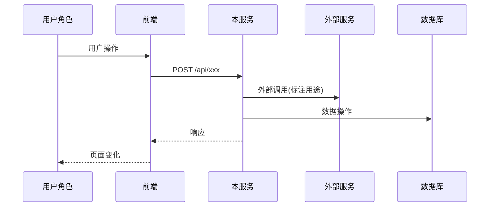
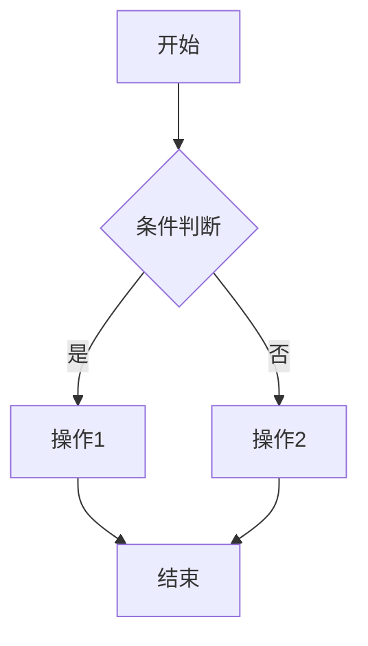
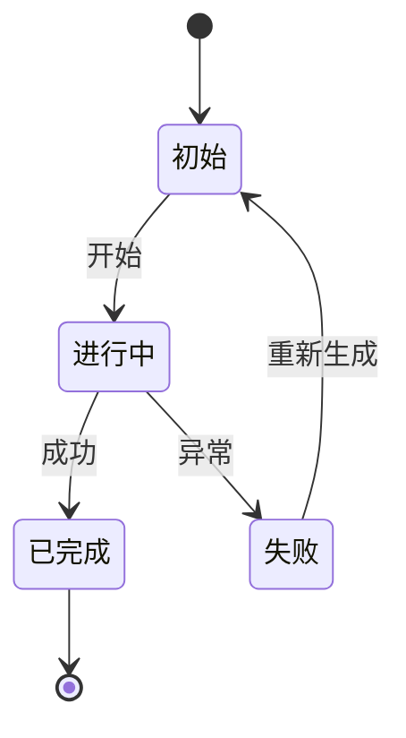

# 飞书技术设计文档自动生成规范

> **配套说明**：本规范配套个人全局 skill `sdlc-doc` / `sdlc-yapi`（暂不在本仓库，见根 README Roadmap）；文中 trellis 为源项目的任务框架，路径约定（`.trellis/tasks/{task-dir}/`）替换为你自己的任务框架即可。2026-09 脱敏整理收录（内网地址/项目 ID 已占位化）。
>
> 调用命令：`/sdlc-doc <task-dir> <YApi分类URL> [飞书文档URL或wiki节点token]`（2026-09-10 前名为 /feishu-tech-review）
>
> 把 trellis 任务产物自动转换为飞书技术设计文档并直接写入飞书，**全程无需人工复制粘贴**；**YApi 是接口信息的单一事实源** —— trellis 任务不维护完整字段表，字段由 AI 基于 prd/design/implement 三件套 + 现有代码 + YApi 基线推断后同步到 YApi，飞书文档只引用 YApi 链接；人类仅在"输入确认"环节一次性补充必要字段。

---

## 术语约定

为避免编号歧义，本文档区分两类编号：

| 记法 | 含义 | 示例 |
|---|---|---|
| **§N** | 本规范自身的章节 | §3 = YApi 接口同步规范 |
| **第 N 章** | 产出的飞书文档章节 | 第 4 章 = 接口契约与数据变更 |

---

## 目录

- §0 · 触发与边界（AI 必做 / AI 禁做）
- §1 · 输入与一次性确认（1.1 字段提取映射 / 1.2 一次性确认字段）
- §2 · 飞书文档结构（固定 5 章：业务背景 / 方案总览 / 业务流程与用户影响 / 接口契约与数据变更 / 风险点）
- §3 · YApi 接口同步规范（3.1 同步时机 / 3.2 三态判定+字段推断+反查场景 A-C / 3.3 字段映射 / 3.4 URL 模板 / 3.5 同步失败降级）
- §4 · 图示规范（4.1 Mermaid 渲染与选型决策树 / 4.2 Mermaid 模板）
- §5 · 自动化流程 SOP（含 lark-doc 调用要点 / YApi 同步要点）
- §6 · 自检 Checklist（完整性 / YApi 同步 / 受众适配 / 自动化）

---

## §0 · 触发与边界

### 触发条件

用户说"生成技术设计文档""写飞书评审文档""tech review doc"，或显式指定 `.trellis/tasks/{task-dir}/`。

### AI 必做

1. 读取 trellis 任务产物三件套：`prd.md` + `design.md` + `implement.md`（均存在则读；缺失则在 §1.2 一次性确认时向用户追问对应内容）
2. **读取现有事实基线**：更新已有接口前必须读取 YApi 原始完整接口；必要时读取现有 Controller / DTO / Enum 作为当前实现参考
3. **基于"YApi 基线 + 现有代码 + prd/design/implement 线索"推断接口完整字段，同步到 YApi**（见 §3），获得 YApi 接口地址列表
4. 一次性向用户确认缺失字段 + 推断不准的字段 + YApi 同步清单（见 §1）
5. 生成 5 章文档（见 §2），第 4 章只引用 YApi 链接、不重复字段表
6. 调用 `lark-doc` skill 创建并写入飞书
7. 按 §6 自检 Checklist 校验，校验通过后返回飞书文档链接 + YApi 接口链接列表

### AI 禁做

- 不编造缺失的业务背景
- 不输出 markdown 让用户手动粘贴
- **不允许覆盖式更新 YApi**(只拿 trellis 增量替换原 schema,导致既有字段丢失) —— 详细硬性流程见 §3.2「更新已有接口的硬性流程」
- **不允许把未在 prd / design / implement / YApi / 现有代码任一来源出现过的字段写入接口文档**（字段推断 ≠ 脑补）

---

## §1 · 输入与一次性确认

### 1.1 trellis 任务产物字段提取映射

| 来源文件 | 提取章节 | 去向 |
|---|---|---|
| `prd.md` | Goal / Scope / Requirements（含接口 path/method/业务语义）/ Acceptance Criteria / Dependencies / Out of Scope | 第 1、2、3、5 章 |
| `design.md` | 分层类清单 / DDL / SQL / 时序图 / 状态机规则 / 接口契约字段 / 错误码 | 第 3、4、5 章 |
| `implement.md` | 执行步骤 / 验证命令 / 回滚点 / 风险与对策 | 第 5 章 |

> trellis 任务产物可能 PRD-only(轻任务)或三件套齐全(复杂任务)。缺失的文件,对应内容在 §1.2 一次性确认时向用户追问。

### 1.2 一次性确认字段

trellis 任务产物通常缺失以下信息，AI 读取完后**汇总一次性提问**，不要逐项追问：

| 字段 | 必填 | 用途 |
|---|---|---|
| 飞书需求文档链接 + 编号 + 优先级 | ✅ | 第 1 章 |
| 业务背景 3-5 句话（谁在什么场景遇到什么问题） | ✅ | 第 1 章 |
| YApi 项目 ID + catid | ✅(从命令 $2 解析,缺失才追问) | §3 同步接口 |
| 推断不准的接口字段（逐接口列出 AI 无法从 prd/design/implement + 代码 + YApi 基线确定的字段） | ✅ | §3 字段推断 |
| YApi 同步清单确认（新建 N 个 / 更新 M 个 / 跳过 K 个） | ✅ | §3 同步结果 |

> **projectId/catid 来源**:命令调用时从 `$2`(YApi 分类 URL) 正则解析,解析成功不重复问;若用户以 AskUserQuestion 形式触发(无 $2),才在此步追问。

缺失字段用 `AskUserQuestion` 一次问完；若 trellis 任务产物已含足够信息，跳过对应项。

**YApi 同步清单格式**（在确认问题里展示）：

```
本次将同步 YApi 接口 3 个：
  新增: POST /meeting/regenerate
  更新: GET /meeting/getRow (新增返回字段 isDeleted)
  跳过: POST /recording/operate (无变更)
是否继续？
```

---

## §2 · 飞书文档结构（固定 5 章）

按评审会讲述顺序排列，遵循"先业务后技术"。

| 章 | 名称 | 受众 | 占比 | 重点 |
|---|---|---|---|---|
| 1 | 业务背景与需求 | 产品 / 测试 / leader | 15% | |
| 2 | 方案总览 | 全体 | 15% | |
| 3 | 业务流程与用户影响 ⚠️ | 产品 / 测试 | 25% | 评审讨论最久 |
| 4 | 接口契约与数据变更 ⚠️ | 技术 / 测试 / 前端 | 30% | 单一事实源 |
| 5 | 风险点 | leader / 测试 | 15% | AI 增量最大 |

---

### 第 1 章 · 业务背景与需求

**目的**：非技术读者 1 分钟理解"为什么做"。

**必含要素**：
- 需求来源：飞书链接 + 编号 + P0/P1
- 业务背景：3-5 句话，"谁在什么场景下遇到什么问题"
- 本次解决的问题：用业务语言，禁止"新增 XX 接口"这类技术描述

**语言约束**：禁止出现 MongoDB / Redis / Feign / MyBatis 等技术词。

---

### 第 2 章 · 方案总览

**目的**：所有受众 30 秒理解"整体怎么做"。

**必含要素**：
1. **一句话方案概述**（主谓宾完整）
2. **改动维度表**（2-4 个维度，每个一句话）
3. **关键决策表**（2-3 行，**仅保留影响业务理解的决策**，用"因为…所以…"句式）

**决策分层原则**（关键）：
- ✅ 留本章：`采用软删除而非物理删除` → 业务理由：保留数据可追溯
- ❌ 移第 4 章折叠块：`权限角色用 GroupUserTypeEnum.getControlList()` → 纯技术实现

---

### 第 3 章 · 业务流程与用户影响 ⚠️ 重点章节

**目的**：产品和测试据此验证流程、写用例。评审会讨论最久。

**必含要素**：
1. **用户操作流程**：改动前后路径对比（跨服务用 Mermaid `sequenceDiagram`，多步骤业务用 `flowchart`）
2. **角色影响矩阵**：角色 × 现状 × 改造后 × 变化
3. **边界场景**：权限拒绝 / 并发 / 重复点击 / 异常

**图示触发规则**（自动判断，不强制）：

| 改动类型 | 图示 |
|---|---|
| 单接口新增且逻辑简单 | 不画 |
| 多角色权限变化 | 角色矩阵表 |
| 跨服务数据流 | Mermaid 时序图 |
| 状态机变化 | Mermaid 状态图 |
| 前后对比（流程/字段） | 对比表 |

---

### 第 4 章 · 接口契约与数据变更 ⚠️ 重点章节

**目的**：技术评审接口设计，测试写接口用例，前端对接。

**单一事实源原则**：接口字段表（路径/方法/请求体/响应体/枚举）**全部落在 YApi**，飞书文档**只放业务语义 + YApi 链接**，不重复字段表。原因：前端对接从 YApi 一键导出 TypeScript；接口变更有 YApi 历史版本追踪；飞书叙述与接口真相合一处维护。

**每个接口在飞书里的固定结构**：

```
🔗 YApi: {YApi 接口详情 URL，见 §3.4}
{METHOD} {path}

业务说明：一句话讲清楚这个接口干什么
权限：{谁能调用}
```

**必含要素**：
1. **新增/修改接口**：每个接口按上述结构
2. **数据模型变更**：新增表/字段/枚举/索引，标注是否需数据迁移（这部分留在飞书，因为 YApi 不承载 ORM/数据库 schema）

**技术决策 callout 位置约束**(与 §2 第 2 章「决策分层」配套):
- 第 2 章只留**业务决策**(影响产品/测试理解的),技术实现决策下沉到第 4 章
- 第 4 章的技术决策 callout **统一放在「数据模型变更」段之后、全章结尾**,作为独立小节「🔧 技术决策说明」
- **不要**把 callout 散落到每个接口块下方(会让前端对接时被技术细节干扰)
- 每条决策格式:「因为 X(约束/风险) → 所以采用 Y(方案) → 影响 Z(接口/字段)」

---

### 第 5 章 · 风险点

**trellis 任务产物 → 飞书增量最大的章节**。prd.md 的 Acceptance Criteria 通常只关注功能验收，飞书评审时 leader 与测试同学**完全依赖**这一章判断上线风险；implement.md 提供执行细节可作为风险点补充线索。

**必含要素**：
1. **风险表**：技术风险（并发/性能/一致性）+ 业务风险（用户感知/权限误判），每条带等级和缓解措施

---

## §3 · YApi 接口同步规范

### 3.1 同步时机

**触发点**：用户说"生成技术设计文档"，AI 内部自动执行，**不是独立指令**。

**执行顺序**：

```
Step A  扫描 prd.md + design.md + implement.md 接口段 → 生成 YApi 同步清单
Step B  向用户展示清单并确认（合并到 §1.2 的一次性确认）
Step C  用户确认后，执行 yapi_save_api 批量同步
Step D  拿到 YApi 接口 URL，作为飞书第 4 章的输入
```

**严禁在以下时机同步**：
- 飞书文档写入过程中（失败会污染已生成的飞书内容）
- 飞书文档写入之后（飞书第 4 章会引用不到 YApi 链接）

> 注:trellis 没有"openspec 定稿"这个节点。改为以任务进入 in_progress（`task start`）作为隐式的事实基线锚点 —— 任务进入 in_progress 意味着 prd/design/implement 已通过 review,可作为 YApi 同步的输入。

### 3.2 同步策略（三态判定 + 字段推断）

AI 对三件套里每个接口签名，按 path + method 去 YApi 反查：

| 状态 | 判据 | 处理 |
|---|---|---|
| **新建** | YApi 搜不到同 path + method | 以三件套接口设计 + 现有代码线索推断完整字段为目标契约新建，catid 从 §1.2 用户给的值 |
| **更新** | YApi 已有，三件套描述了字段/说明/枚举/权限/语义变化 | **先读取 YApi 原始完整接口，再做合并式更新**，传 `id`（YApi 接口 ID） |
| **跳过** | YApi 已有，且三件套未描述该接口契约变化 | 不调用，记录到清单的"跳过"组 |

#### 设计阶段事实源分层（关键）

| 来源 | 定位 | 使用规则 |
|---|---|---|
| YApi 现有接口 | 当前对外契约基线（**单一事实源**） | 更新已有接口时必须完整读取并保留未变更字段；新建接口的最终契约也以此为准 |
| 现有源码 / DTO / Enum | 当前实现参考 | 用于理解已有字段含义、枚举值、兼容性；**不能否定 trellis 任务中明确提出的未来变更** |
| trellis prd/design/implement | 本次目标设计线索 | 提供接口 path/method/业务语义/字段线索；**trellis 不维护完整字段表**，字段缺失时结合代码 + YApi 基线推断,推断不准走 §1.2 向用户确认 |
| 用户补充说明 | 人工确认事实 | 用于补齐三件套缺失的业务含义、字段说明、YApi 分类等 |

#### 更新已有接口的硬性流程

```
Step 1  按 path + method 找到 YApi interfaceId
Step 2  读取该 interfaceId 的原始完整详情
Step 3  解析原始 req_body / res_body / req_query / req_params / req_headers / tag
Step 4  从 trellis 三件套提取本次变更增量
Step 5  执行"保留原字段 + 应用变更增量"的合并
Step 6  生成字段级 diff：新增 / 修改 / 删除 / 保持不变
Step 7  先对 1 个接口试写并复查 YApi 详情，确认未丢字段后再批量处理
```

**严禁覆盖式更新**：

```text
错误做法：
  trellis design.md 只写 awardLevel，就把 YApi req_body_other/res_body 改成只有 awardLevel 的 schema。

正确做法：
  先读取 YApi 原接口完整 schema，保留 AwardSaveReq / AwardQueryReq / AwardApplyDetailRespDto 中既有字段，
  再只对 awardLevel 的类型、枚举、说明、required 等设计变更做增量修改。
```

#### 反查工具（按优先级，按场景选路径）

> ⚠️ **工具健康度要按环境实测**（源环境 2026-06 验证过的坑，迁移环境时先跑一次 curl 验证 list_cat 可用）：
>
> | 工具 / 路径 | 源环境状态 | 说明 |
> |---|---|---|
> | `yapi_get_api_desc`（单接口详情） | ✅ 可用 | 修改前拿原 schema 必走此路径 |
> | `yapi_save_api`（新建/更新接口） | ✅ 可用 | 写入路径正常 |
> | `yapi_get_categories` | ⚠️ **不可用** | 返回分类但每个分类的 `接口列表` 都为空 + 报 "与YApi服务器通信失败"。MCP 内部走的 `/api/interface/list` 接口在该环境**忽略 catid 参数**，根本拉不到分类下的接口。**只能用来查项目下有哪些分类（拿 catid 对应的分类名），不能用来反查接口** |
> | `yapi_search_apis` | ❌ **禁用** | 多版本抛 `Cannot read properties of undefined (reading 'toLowerCase')`；不抛异常时返回任意 30 条接口无过滤效果。**已从 allowed-tools 移除,AI 在任何场景都不得调用** |
> | curl `/api/interface/list_cat?catid=xxx` | ✅ **可用** | YApi 原生 cat 列表接口，严格按 catid 过滤，是 MCP `get_categories` 的可靠替代 |
>
> 经验：MCP 工具封装层不可靠时，curl 原生接口是最稳的兜底——工具健康度表本身就是防坑资产，换环境先复测再信。

##### 场景 A：用户给的 URL 里含 apiId（修改/查看单个接口）

直接走 MCP 单接口详情，一条路径解决：

```
URL 形如：http://<yapi-host>/project/1/interface/api/1001
                                ↑
                              apiId

→ mcp__yapi-auto-mcp__yapi_get_api_desc(projectId=1, apiId=1001)
  返回完整 req_body / res_body / headers
→ 按需要 → mcp__yapi-auto-mcp__yapi_save_api(id=1001, ...)
```

不需要先 get_categories 或 search，URL 里的 apiId 就是匹配键。

##### 场景 B：用户给分类 URL（新增 / 批量更新某分类下接口）

URL 里没有 apiId 时，用 curl + token 走原生 `list_cat` 列出分类下全部接口（若该环境 MCP `get_categories` 失败，不能走）：

```
URL 形如：http://<yapi-host>/project/1/interface/api/cat_101
                                      ↑
                                    catid

→ curl "/api/interface/list_cat?catid=101&token=$TOKEN"
  返回该 catid 下全部接口的 _id / method / path / title
→ 按 path 匹配定位 _id
→ mcp__yapi-auto-mcp__yapi_get_api_desc(apiId=_id) 拿详情
```

##### 场景 C：查项目下所有分类的 catid ↔ 分类名映射

只在这种场景下用 `yapi_get_categories`，且只读它的**分类清单**部分（忽略"接口列表"字段）：

```
→ mcp__yapi-auto-mcp__yapi_get_categories(projectId=1)
  从返回里取每个分类的 分类ID / 分类名称，建 catid↔name 映射
```

##### Token 获取（curl 路径必需）

从你的 MCP 配置中取（如 `~/.claude.json` 的 `mcpServers.yapi-auto-mcp.args` 中 `--yapi-token=projectId:token,...`），按 projectId 拆出对应 token。不要把 token 写进任何入库文件。

##### 反查脚本模板（场景 B 直接复用）

```bash
TOKEN="<从 MCP 配置取项目对应的 token>"
BASE="http://<yapi-host>"          # 替换为你的 YApi 地址
CATID=101                          # 替换为目标 catid
TARGET_PATH="goods/v1/order"       # 替换为目标 path 子串（可选）

curl -sS "$BASE/api/interface/list_cat?catid=$CATID&token=$TOKEN" \
  | jq -r ".data.list[] | select(.path | contains(\"$TARGET_PATH\")) | \"id=\(._id)  \(.method)  \(.path)  \(.title)\""
```

无 jq 时用 python3 等价解析。拿到 `id` 后进入场景 A 的流程。

**写入工具**：`mcp__yapi-auto-mcp__yapi_save_api`，必填 `projectId / catid / title / path / method`；更新场景必传 `id`。

### 3.3 字段映射（trellis 三件套 + 现有代码 + YApi 基线 → YApi）

| 字段来源 | YApi 参数 | 类型约束 | 更新规则 |
|---|---|---|---|
| 接口路径 | `path` | string | path + method 是接口匹配键，非明确迁移不得改 |
| HTTP 方法 | `method`（大写） | string | 非明确迁移不得改 |
| 中文接口名 / 业务说明 | `title` + `desc` | string | 可按 trellis 三件套优化，但不得丢失关键业务说明 |
| 请求体字段 | `req_body_is_json_schema=true` + `req_body_type=json` + `req_body_other` | JSON Schema 对象或对象字符串 | **基于原 schema 合并** |
| 查询参数 | `req_query` | JSON 数组字符串 | 基于原数组按参数名合并 |
| 路径参数 | `req_params` | JSON 数组字符串 | 基于原数组按参数名合并 |
| 请求头 | `req_headers` | JSON 数组字符串 | 基于原数组按名称合并 |
| 响应体 | `res_body_is_json_schema=true` + `res_body_type=json` + `res_body` | JSON Schema 对象或对象字符串 | **基于原 schema 合并** |

**关键约束**：

1. **业务含义必填**：YApi 字段的 `description` 必须写业务含义，不只写英文字段名（例如 `meetingId` 的 description 应为"AI 活动记录 ID"）。
2. **list 类参数必须传合法 JSON 数组字符串**，不能传逗号分隔字符串。错误：`"V3.6.7,集备手机端"`；正确：`["V3.6.7","集备手机端"]`。
3. **JSON Schema 不做二次转义**：`req_body_other` / `res_body` 可直接传 JSON Schema 对象或对象字符串，不要外层再包引号。
4. **更新前必须保留原始副本**：记录原始 interfaceId、原始 req/res schema、更新时间；失败时可回滚或人工比对。
5. **批量更新必须先试写一个接口**：第一个接口更新后立即重新读取 YApi 详情，确认原字段未丢失，人工确认无误后，再继续处理剩余接口。

### 3.4 YApi URL 模板

飞书文档引用 YApi 链接时**统一用以下格式**，避免每次现拼。注意区分两种 URL 语义：

| 用途 | URL 模板 | 使用场景 |
|---|---|---|
| **单接口详情** | `http://{yapi-host}/project/{projectId}/interface/api/{interfaceId}` | 第 4 章每个接口的固定引用（精确到单个接口） |
| **分类列表** | `http://{yapi-host}/project/{projectId}/interface/api/cat_{catId}` | 概览、批量查看某分类下所有接口 |

- `{yapi-host}`：你的 YApi 服务地址（含端口），环境不同从 §1.2 用户确认时一并问
- `{projectId}`：YApi 项目 ID
- `{interfaceId}`：具体接口 ID（更新同步后从 YApi 返回值拿到）
- `{catId}`：YApi 项目分类 ID

**示例**：
- 单接口：`http://<yapi-host>/project/1/interface/api/1001`
- 分类列表：`http://<yapi-host>/project/1/interface/api/cat_101`

> ⚠️ 飞书第 4 章每个接口的 `🔗 YApi:` 链接**必须用单接口详情 URL**，不要用分类列表 URL。

### 3.5 同步失败的降级

| 失败场景 | 处理 |
|---|---|
| YApi 项目 ID / catId 用户未给 | 在 §1.2 确认时强制问出，不跳过 |
| YApi 网络错误 / 鉴权失败 | 终止整个流程，向用户报错，不降级到"只写飞书" |
| 单个接口同步失败 | 记录失败项，其余继续；失败项在飞书第 4 章降级为"⚠️ YApi 同步失败，字段表见本文档"并保留字段表 |

---

## §4 · 图示规范

### 4.1 飞书原生 Mermaid 渲染（lark-doc）

lark-doc 通过 `<whiteboard>` 标签**原生渲染 Mermaid 为可编辑画板**，不是源码块。写入方式：

```xml
<whiteboard type="mermaid">
sequenceDiagram
  participant U as 用户角色
  ...
</whiteboard>
```

**图类型选型**（lark-doc 最佳实践）：

| 图类型 | 写法 | 适用场景 |
|---|---|---|
| 时序图 `sequenceDiagram` | `<whiteboard type="mermaid">` | 跨服务数据流（最常用） |
| 类图 `classDiagram` | `<whiteboard type="mermaid">` | 领域模型 |
| 饼图 `pie` | `<whiteboard type="mermaid">` | 占比 |
| 甘特图 `gantt` | `<whiteboard type="mermaid">` | 排期 |
| 思维导图 mindmap | `<whiteboard type="mermaid">` | 需求拆解 |
| 流程图 / 状态图 / 架构图 | `<whiteboard type="svg">完整 SVG</whiteboard>` | 走 SVG 路径，主 Agent 直接插入 |
| 复杂自定义图 | 先插 `<whiteboard type="blank">`，SubAgent 读 `lark-whiteboard` skill 写入 | 需要复杂路由/场景选型 |

**SVG 约束**：必须完整自包含（含 `<svg>` 根节点和 viewBox），不引用外部资源；禁用 `<radialGradient>` / `<filter>` / `<clipPath>` / `<mask>`（画板不支持）。

### 4.2 Mermaid 模板（3 类）







---

## §5 · 自动化流程（AI 执行 SOP）

```
Step 1  读 trellis 任务三件套（prd.md + design.md + implement.md，缺失项在 Step 3 追问）
        ↓
Step 2  扫描三件套接口段，生成 YApi 同步清单（新建/更新/跳过三态）
        结合现有代码 + YApi 基线 + 三件套线索，推断每个接口完整字段
        ↓
Step 3  按 §1.2 用 AskUserQuestion 一次性问：
         - 缺失业务字段（飞书需求链接/业务背景/飞书位置）
         - YApi projectId / catid
         - 展示 YApi 同步清单，等待用户确认
        ↓
Step 4  用户确认后，按 §3 执行 yapi_save_api 批量同步
         - 收集所有 YApi 接口 URL，供第 4 章引用
        ↓
Step 5  按 §2 生成完整 XML（内存中，不落盘）
         - 第 4 章每个接口用 YApi 单接口 URL + 业务说明，不写字段表
        ↓
Step 6  按 §6 自检 Checklist 逐项校验,不通过项按来源分流:
         - **XML 侧**(章节结构/受众/图示):自动修订 XML,不动 YApi
         - **YApi 侧**(字段丢失/未读原始 schema/未试写先批量/字段脑补):回退 Step 4 重做同步
         - **行为类**(已发生动作无法靠修订补救):如"未读取原始完整详情",必须回退 Step 4
        ↓
Step 7  调 lark-doc skill：
         - create/overwrite 写入飞书文档
         - 时序图用 <whiteboard type="mermaid">
         - 技术决策段用 callout 容器视觉隔离
        ↓
Step 8  返回：
         - 飞书文档链接
         - YApi 接口链接列表
         - 简要摘要（章节数/接口数/风险数）
```

### lark-doc 调用要点

- 用户指定位置 → 若只给知识库空间，在空间根创建；若给父节点，创建为子文档
- 标题默认取 trellis 任务的 title（从 prd.md H1 或 task.json 取），用户可改
- 技术决策用 callout 容器包裹，视觉上与正文隔离（lark-doc XML 无原生 `<details>`，用 callout 模拟）
- 表格、代码块、列表全部走 lark-doc 的结构化 block，**不要**塞进纯文本

### YApi 同步要点（与 §3.2 互补，聚焦时序与容错）

- 同步顺序在飞书写入**之前**（飞书第 4 章依赖 YApi URL）
- 单个接口失败不阻塞其他接口
- YApi 鉴权失败 = 流程终止，不降级
- 更新已有接口的字段合并硬性流程见 §3.2「更新已有接口的硬性流程」

---

## §6 · 自检 Checklist（生成后强制执行）

### 完整性

- [ ] 第 1 章有飞书需求链接 + 编号 + 优先级
- [ ] 第 1 章业务背景 ≥ 3 句话，无技术词
- [ ] 第 2 章有一句话方案概述
- [ ] 第 2 章关键决策表 ≤ 3 行（技术决策已下沉）
- [ ] 第 3 章有用户操作流程 + 角色影响矩阵 + 边界场景
- [ ] 第 4 章每个接口有 YApi 链接 + 业务说明 + 权限 + 关键约束
- [ ] 第 4 章技术决策在 callout 容器内,**统一位于第 4 章末尾「🔧 技术决策说明」小节**(不散落到各接口块下)
- [ ] 第 5 章有风险表，含等级与缓解措施

### YApi 同步

- [ ] 三件套(prd/design/implement)中所有接口都已同步到 YApi（新建/更新/跳过三态明确）
- [ ] 更新接口前已读取 YApi 原始完整详情，而不是只看 trellis 任务产物的增量
- [ ] 更新接口采用"原始完整结构 + trellis 变更增量"的合并结果
- [ ] 未被 trellis 任务产物明确修改/删除的请求字段、响应字段、查询参数、路径参数、请求头均已保留
- [ ] 第一个更新接口已试写并重新读取详情，确认没有字段丢失后才批量同步
- [ ] 字段推断无法确定的字段,已列入 §1.2 向用户确认且未被脑补
- [ ] YApi 字段 description 写了业务含义
- [ ] 飞书第 4 章每个接口都引用了 **YApi 单接口 URL**（不是分类 URL）
- [ ] 飞书第 4 章**没有**重复 YApi 已有的字段表

### 受众适配

- [ ] 第 1 章无技术术语
- [ ] 图示紧跟文字注释

### 自动化

- [ ] YApi 接口已同步（或明确标注同步失败降级原因）
- [ ] 文档已通过 lark-doc 写入飞书
- [ ] 返回了飞书文档链接 + YApi 接口链接列表

> **不通过项分流处理**(不能一律"自动修订 XML"):
> - XML 侧(章节结构/受众/图示类型)→ 自动修订 XML
> - YApi 侧(字段丢失/覆盖式更新/未读原始 schema)→ 回退 Step 4 重做同步
> - 行为类(已发生的遗漏动作,如"未试写先批量")→ 回退 Step 4
> 每条修订点在进入 Step 7 前必须标注并闭环。

---

## 附录：4 条核心原则

1. **翻译而非照搬**：trellis 任务产物(prd/design/implement)每块信息经过"受众过滤 + 语言转译"才能进入飞书文档。
2. **分层呈现**：callout、影响矩阵、角色权限矩阵是分层的三个工具；同一份文档服务 4 类受众靠分层而非堆砌。
3. **YApi 为接口单一事实源**：trellis 不维护完整字段表，字段由 AI 基于三件套 + 现有代码 + YApi 基线推断后落到 YApi；飞书文档只引用不重复；前端对接、变更追踪、Mock 联调都以 YApi 为准。
4. **零手动操作**：从 trellis 读取 → 字段推断 → YApi 同步 → 飞书写入全链路自动化，人类只在输入确认环节介入一次。
