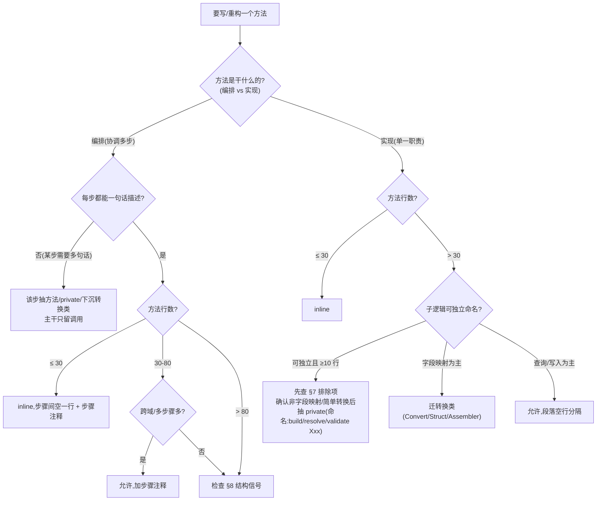
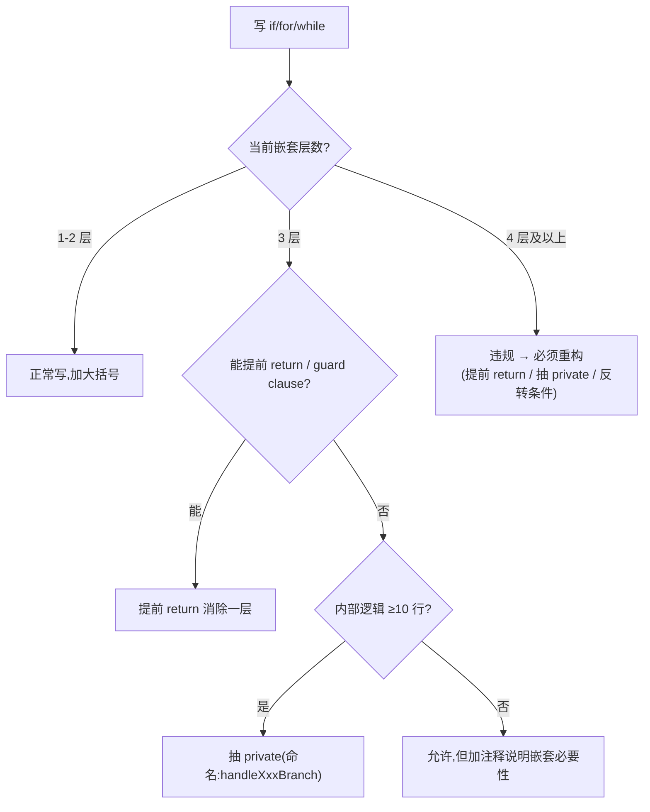
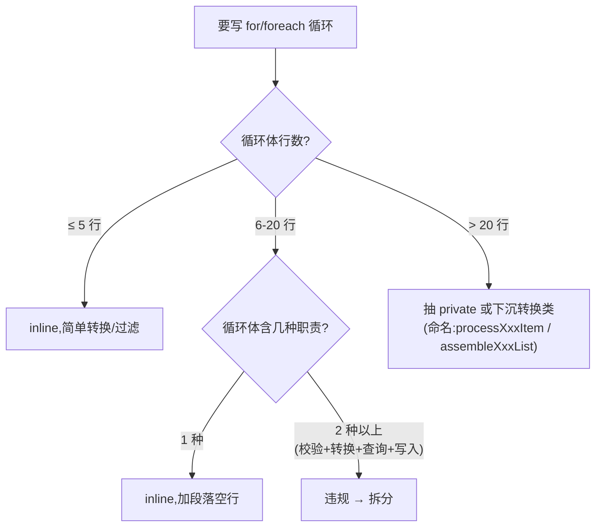
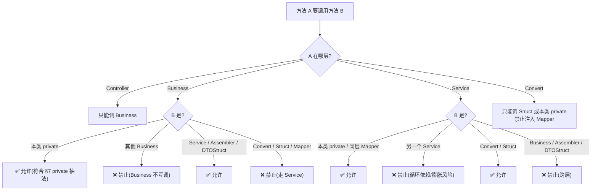

### 方法组织规范

#### §0 概述:通用设计哲学

> **主干负责编排,复杂逻辑独立拆分。**

程序员手写代码时按功能和职责拆分:能独立命名的逻辑独立成方法/类,主干只做编排。AI 也必须按这套判断执行。

**判定依据**:主干每一步都应该能用一句话描述。一步需要多句话解释 → 有内部复杂度 → 应独立。

**这是通用原则**:适用于任何方法 —— 不论 Business / Service / Convert / Assembler / private / main 方法,都要遵循同样的拆分逻辑。

> 本文档是项目的方法组织实施标准,所有规则在本文档内完备,不依赖外部文件。

---

#### §1 软阈值(辅助参考,非违规判定)

| 方法类型 | 理想行数 | 超过后的处理 |
| :--- | :--- | :--- |
| Controller / 入口方法 | ≤ 10 行 | 超过 → 检查是否混入业务逻辑 |
| 任意 public 编排方法 | ≤ 30-50 行 | 超过 → 检查 §8 结构信号 |
| 任意业务实现方法 | ≤ 50-80 行 | 超过 80 → 检查 §8 结构信号 |
| 任意 private 辅助方法 | ≤ 30 行 | 超过 → 通常意味着该走转换类而非 private |

**关键说明:**
- 软阈值**不是违规判定标准**,只是触发结构检查的信号
- 真正违规由 §8 结构信号判定
- **长方法不一定违规**(段落清晰 + 复杂子逻辑已抽 private/转换类的 80 行方法可接受)
- **短方法不一定合规**(20 行方法混合 4 职责仍违规)

---

#### §2 复杂度归属原则(把哲学翻译成可执行规则)

每写一段逻辑,先问"它属于什么类型,应该放在哪里":

| 逻辑类型 | 归属 | 信号特征 |
| :--- | :--- | :--- |
| **流程编排**(先做什么、再做什么) | 主干方法 | 调用其他方法,本身不含字段映射/循环 |
| **字段映射**(setXxx 链) | 转换类(Convert/Struct/Assembler) | 连续 `target.setXxx(source.getXxx())` |
| **业务校验**(简单格式/取值) | OVAL 注解 | 非空/长度/枚举/范围/格式 |
| **业务校验**(跨字段/查 DB) | 业务层代码(Service/Business) | 二选一必填、存在性、状态机 |
| **复杂组装**(多源 + 计算 + 循环) | 转换类(Convert/Assembler) | 需要用一个名字描述的组装过程 |
| **简单派生**(取当前时间、取长度) | 主干 inline | 1-2 行,无独立命名价值 |

**通用判定流程**(每写一段逻辑必走,与所在层无关):
1. 这段逻辑能用一句话独立描述吗?(如"分类树校验"、"名单透传")
   - 不能 → inline
   - 能 → 进入第 2 步
2. 这段逻辑属于上表哪一类?
3. 归属已定 → 这段逻辑必须放到对应位置,**不得留在主干**

---

#### §3 决策树 1:通用方法组织(主轴)

**通用配套规则(与所在层无关):**
- 编排类方法:**步骤间空一行 + 步骤注释**是硬性约束
- 实现类方法:**不为消重复抽 private**,除非满足"多处共用 + 块 ≥10 行完全相同"
- 字段映射类长方法:迁转换类,**不要靠抽 private 解决**

---

#### §4 决策树 2:嵌套深度

**配套反模式:**
- ❌ `if → if → if → if` 链(应反转条件提前 return)
- ❌ `for → if → if → for`(循环嵌套循环应抽 private)
- ❌ 锁/事务内 3 层以上嵌套(锁体应只调一个方法)

---

#### §5 决策树 3:循环体复杂度

**配套硬性条款:**
- **禁止**循环体内数据库查询(N+1)→ 改批量查 Map 再循环
- **禁止**循环体内 `new` + 大段 setter → 迁转换类
- **禁止**循环体内嵌套循环 → 抽 private

---

#### §6 决策树 4:方法间调用方向(项目分层约束)

> 前 3 棵决策树是通用的,这一棵是项目特定分层约束。

---

#### §7 private 抽法完整规则

| 场景 | 处理 | 理由 |
| :--- | :--- | :--- |
| 2-3 行的短逻辑 | **禁止**抽 private(inline) | 跳转过多,编排类代码难读 |
| 多个 public 共用的入口规范化(如 `normalizeXxx`) | ✅ 抽 private | 复用价值高 |
| 多个 public 共用且块 ≥10 行完全相同 | ✅ 抽 private | 消重复 |
| 字段映射 / setter 链 | **禁止**抽 private → **迁转换类** | 字段映射有专属层 |
| 简单 list→map 转换 | **禁止**抽 private → inline lambda | 抽出来反而更难读 |
| persist 层写库职责(`initXxx`/`persistXxx`) | ✅ 抽 private | 写库职责独立 |
| 锁/事务体内 >20 行的业务 | ✅ 抽 private,锁体只调一个方法 | 锁体应极薄 |
| 含独立命名价值的复杂分支(如"分类树校验") | ✅ 抽 private | 名字即文档 |
| 含跨表关联/循环/分支的 Entity→VO 转换 | **禁止**抽 private → **迁转换类** | 转换有专属层 |

**判定核心问题(通用):**
- 这段逻辑能独立命名吗?(能 → 候选抽 private;不能 → inline)
- 它属于哪一类?(字段映射 → 转换类;复杂组装 → 转换类;写库 → private;流程编排 → 主干)

---

#### §8 结构信号违规清单(核心违规判定,与行数无关)

> **【强制】** 出现以下任一结构信号即违规:

1. **主干方法混合 3 种以上职责**:一个方法同时做"校验 + 查询 + 转换 + 写入"中的 3 种以上 → 重构
2. **主干某一步无法用一句话描述**:说明该步有内部复杂度 → 该步独立成方法/private/转换类
3. **嵌套 4 层及以上**(if/for 嵌套) → 必须重构
4. **循环体内数据库查询** → N+1,改为批量查 Map
5. **循环体内 `new` + 大段 setter** → 迁转换类(详见 §5「配套硬性条款」)
6. **锁/事务体内超过 20 行** → 抽 private,锁体只调一个方法
7. **try-catch 包裹超过 30 行** → 抽 private,catch 只做异常转换
8. **if-else if 链 ≥ 4 分支** → 考虑枚举驱动或 Map 分发
9. **3 行及以上连续 `target.setXxx(source.getXxx())`** → 迁转换类
10. **复杂调用嵌套内联**:一个复杂调用的返回值直接内联为另一个复杂调用的入参(嵌套 ≥2 层) → 主干步骤无法命名、无法断点/日志,拆为可命名的局部变量(通用判定,与所在层、方法名无关)
11. **列表顺序未显式定义**:接口出参含列表但顺序未由代码显式定义(排序字段或稳定业务规则),依赖 DB/存储默认返回顺序 → 隐式契约,补显式排序(通用判定,数据源为 MySQL/Mongo/内存均适用)
12. **多链路口径漂移**:同一入参字段在多条代码路径被消费时,判空/默认值/转换处理不一致 → 其一必为 bug,写第二条消费路径前必须核对既有链路口径

---

#### §9 检查清单

**主干编排层(通用):**
- [ ] 主干每一步都能用一句话描述
- [ ] 编排类方法每步一次方法调用,步骤间空一行 + 步骤注释
- [ ] 主干不混合 3 种以上职责(校验/查询/转换/写入)

**复杂度归属层(通用):**
- [ ] 字段映射类逻辑已迁转换类,不在 private
- [ ] 简单校验走 OVAL 注解,复杂校验在业务层
- [ ] 循环体内无数据库查询、无 new+setter 链

**结构信号层(通用):**
- [ ] 方法不存在 §8 结构信号违规清单中的任一模式
- [ ] 嵌套 ≤ 3 层(4 层及以上必违规)
- [ ] if-else if 链 ≤ 3 分支
- [ ] 主干复杂调用的入参均为可命名局部变量,无 ≥2 层嵌套内联(§8-10)
- [ ] 返回的每个列表,顺序均由代码显式定义,不依赖存储默认返回顺序(§8-11)
- [ ] 同一入参字段在多条代码路径的判空/默认值口径一致(§8-12)

**private 抽法层(通用):**
- [ ] 不存在"为 2-3 行逻辑抽 private"
- [ ] 不存在"为消重复抽 private"(除非块 ≥10 行完全相同)
- [ ] 字段映射未抽 private(已迁转换类)

**方法间调用层(项目分层约束):**
- [ ] 不存在 Service 互调
- [ ] 不存在 Business 直调 Convert/Mapper
- [ ] Convert 不注入 Mapper
