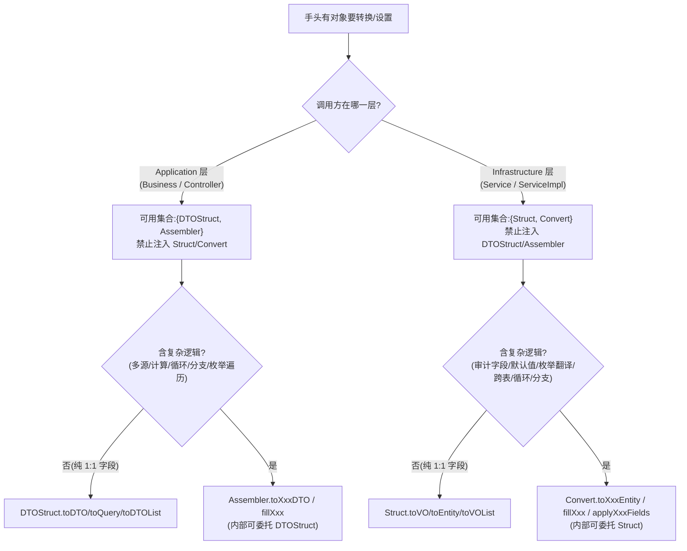

### 对象转换规范

#### 概述

> **【强制】** 所有对象设置、转换逻辑必须放在专门的转换类中,禁止在业务代码里直接进行对象属性拷贝。

**业务代码**(统称"非转换类")显式枚举为:`Controller / Service / ServiceImpl / Business`。
**转换类**只有以下四类,且**层归属强制不可越界**:

| 转换类 | 所在层 | 可注入的同层 MapStruct |
| :--- | :--- | :--- |
| `XxxDTOStruct`(MapStruct) | Application | — |
| `XxxAssembler` | Application | `DTOStruct` |
| `XxxStruct`(MapStruct) | Infrastructure | — |
| `XxxConvert` | Infrastructure | `Struct` |

**调用方向约束**:`Assembler` 可注入 `DTOStruct`;`Convert` 可注入 `Struct`;**禁止跨层注入**(Application 层代码不得注入 Infrastructure 的 `Struct`/`Convert`,反之亦然)。

---

#### 1. 命名与路径

| 类 | 命名 | 路径 |
| :--- | :--- | :--- |
| DTOStruct(MapStruct) | `XxxDTOStruct` | `application.assembler.mapstruct` |
| Assembler | `XxxAssembler` | `application.assembler` |
| Struct(MapStruct) | `XxxStruct` | `infrastructure.[module].convert.mapstruct` |
| Convert | `XxxConvert` | `infrastructure.[module].convert` |

> 具体场景归属见 §2 决策树,不在本表枚举。

---

#### 2. 决策树(编码前必读)

判定两步走:**先按调用方所在层锁定可用转换类集合,再按 I/O 类型 + 复杂度选具体类。**

**文字版速查:**

**Application 层(可用 DTOStruct / Assembler):**
- Req → Query(纯字段)→ `DTOStruct.toQuery(req)`
- Req → Query(含 isBlank / Long.valueOf / 校验)→ `Assembler.toXxxQuery(req, ...)`,内部可委托 `DTOStruct`
- VO → DTO(纯字段)→ `DTOStruct.toDTO(vo)`
- VO → DTO(含多源组装 / 计算)→ `Assembler.toDTO(vo, extra...)`
- 枚举 / 常量 → DTO 列表 → `Assembler.toXxxFromEnum()`
- 已有 DTO ← 补字段 → `Assembler.fillXxx(dto, source)`

**Infrastructure 层(可用 Struct / Convert):**
- Req → Entity(纯字段)→ `Struct.toEntity(req)`
- Req → Entity(含审计字段 / 默认值 / 状态强制)→ `Convert.toXxxEntity(req, userInfo)`,内部可委托 `Struct`
- Entity → VO(纯字段)→ `Struct.toVO(entity)`
- Entity → VO(含枚举翻译 / 格式化)→ `Struct` + `@Mapping(expression)`
- Entity → VO(含跨表关联 / 循环 / 分支)→ `Convert.toXxxVOList(...)`
- 已有 Entity ← 补字段 → `Convert.applyXxxFields(entity, source)`
- 已有 VO ← 补字段 → `Convert.fillXxx(vo, source)`
- 枚举 / 常量 → VO 列表 → `Convert.toXxxFromEnum()`

---

#### 3. 红线规则

> **【强制】** 任何非转换类文件(`Controller / Service / ServiceImpl / Business`)中出现以下任一模式,即违规:

1. **连续 3 行及以上** 的 `target.setXxx(source.getXxx())` 或 `new Xxx() + setter`
2. **循环内** 的 `new + setter`,不论行数(循环放大了拷贝量)
3. 含 `if (isNotBlank) { query.setXxx(...); }` 的条件分支,按 2 行计入阈值

**允许的例外**(1-2 行,无逻辑分支):
- 状态机变更:`entity.setStatus(...)`
- 分页计算:`query.setOffset((page - 1) * pageSize);`
- 单一结果回填:`rowVO.setTotalCount(count);`

---

#### 4. 反例对照(用真实代码锚定规则)

> 以下反例的完整代码见对应 file:line 锚点(脱敏虚构路径)。两类违规必须显式区分:**Business 越界**(RE-1~RE-4)vs **转换类内部职责越界**(RE-5~RE-8)。

##### 4.1 Business / Controller 越界（RE-1 ~ RE-4）

| 编号 | 反例特征 | 真实代码锚点 | 正例归属 |
| :--- | :--- | :--- | :--- |
| **RE-1** | Business 中循环 new DTO（枚举转 DTO） | `hr-application/.../goods/GoodsBusiness.java:319-323` | `Assembler.toXxxFromEnum()` |
| **RE-2** | Business 中 VO→DTO 含 5 行 setter + String.valueOf 类型转换 | `hr-application/.../goods/GoodsBusiness.java:382-389` | `DTOStruct` + `@Mapping(expression)` |
| **RE-3** | Business 中 27 行 Req→Query setter 链（含 `if (isNotBlank) { query.setXxx(...) }` 条件分支） | `hr-application/.../goods/GoodsBusiness.java:461-494`（`buildCommonListQuery`） | `Assembler.toXxxQuery(req, ...)` |
| **RE-3b** | 同模式跨模块复发：Business 中 3 个 private `buildXxxQuery`（Req→Query setter + isNotBlank 条件分支） | `hr-application/.../business/OrderBusiness.java:298-355`（`buildSquareListQuery` / `buildMyListQuery` / `buildManagePageQuery`） | `Assembler.toXxxQuery(req, ...)` |
| **RE-4** | Business 中循环 new 快照对象（private 方法 + 索引计算 + 条件分支） | `hr-application/.../goods/GoodsCategoryBusiness.java:141-155`（`toSnapshotItemList`） | `Assembler.toXxxItemList(reqList)` |

> **RE-3/RE-4 关键提示**:即使在 Business 里封装成 `private` 方法,只要方法体是转换逻辑,仍属违规。

##### 4.2 转换类内部职责越界（RE-5 ~ RE-8）

| 编号 | 反例特征 | 真实代码锚点 | 正例归属 |
| :--- | :--- | :--- | :--- |
| **RE-5** | Convert 里混入 10 行纯 1:1 字段拷贝（`applyAllBusinessFields` 无逻辑分支） | `hr-infrastructure/.../convert/GoodsConvert.java:90-104` | 简单拷贝 → `Struct`;含审计/默认值 → `Convert` 委托 `Struct` |
| **RE-5b** | 同模式跨模块复发：Convert 里两个纯 setter 实体构建方法（仅 `nullToEmpty` 类型默认值，无循环/条件/聚合） | `hr-infrastructure/.../order/convert/OrderConvert.java:53-66,96-109`（`toAddOrderEntity` / `toApplyCreateOrderEntity`） | 纯字段 + `nullToEmpty` → `Struct` + `@Mapping(expression)`;`published`/审计等强制值 → `Convert` 委托 `Struct` 补齐 |
| **RE-6** | Convert 里 8 行 Entity→VO 纯 1:1 setter（仅 1 行含 `Objects.equals` 判断） | `hr-infrastructure/.../convert/GoodsLessonConvert.java:70-80`（`fillBaseFromLesson`） | 简单拷贝 + expression → `Struct`;含跨表/循环 → `Convert` |
| **RE-7** | DTOStruct 用 `default` 方法包装外层 DTO（`new` 外层 DTO + `set` 内层 list） | `hr-application/.../assembler/mapstruct/GoodsPhaseDTOStruct.java`（示意） | 字段映射 → `DTOStruct`;外层 DTO 包装 → `Assembler` |
| **RE-8** | DTOStruct 用 `default` 方法做循环拆平 + 业务判断（`resolveScopeType` 等 helper） | `hr-application/.../assembler/mapstruct/LoginDTOStruct.java`（示意） | 纯字段映射 → `DTOStruct`;循环拆平 + 枚举分支 + 多步 helper → `Assembler` |

---

#### 5. 检查清单

**Business / Controller 越界检测:**
- [ ] 不存在连续 3 行及以上的 `target.setXxx(source.getXxx())`
- [ ] 不存在任何 `for (...) { new Xxx(); xxx.setXxx(); }` 循环创建对象模式(不论行数)
- [ ] 不存在封装成 `private` 方法的转换逻辑(RE-3/RE-4 模式)
- [ ] 不存在 `BeanUtils.copyProperties` / `BeanUtil.copyProperties`

**转换类内部职责检测:**
- [ ] `Convert` / `Assembler` 中不存在方法体 90%+ 为纯 1:1 setter 的方法(应迁至同层 `Struct`/`DTOStruct`)
- [ ] 简单字段拷贝通过 MapStruct 完成;`Convert`/`Assembler` 仅承担含逻辑的字段处理

**层归属检测:**
- [ ] Application 层代码未注入 Infrastructure 的 `Struct`/`Convert`
- [ ] Infrastructure 层代码未注入 Application 的 `DTOStruct`/`Assembler`

**MapStruct 边界检测:**
- [ ] `*DTOStruct` / `*Struct` 中不存在 `default` 方法 `new` 外层 DTO 再 set 内层 list(应放 `Assembler` / `Convert`)
- [ ] `*DTOStruct` / `*Struct` 中不存在 `for` / `while` 循环拆平嵌套结构(应放 `Assembler` / `Convert`)
- [ ] `*DTOStruct` / `*Struct` 中不存在业务条件判断、scope 解析、白名单、枚举分支(应放 `Assembler` / `Convert` 或 `Business`)

---

#### 6. MapStruct(Struct/DTOStruct)与 Assembler/Convert 边界

> **【强制】** `*DTOStruct` / `*Struct`(MapStruct 接口)只做**声明式字段映射**;外层 DTO 组装、循环拆平、条件判断放 `*Assembler` / `*Convert`(`@Component`)。

MapStruct 代码生成方便,容易误把 `default` 方法当成普通工具类堆业务逻辑。一旦 Struct 里出现循环或条件分支,既无法享受 MapStruct 自动生成的好处,又破坏了"Struct 纯映射、Assembler/Convert 管组装"的清晰分层。

**`*DTOStruct` / `*Struct` 允许:**
- `@Mapping` / `@Mapping` + `expression` 做字段重命名、类型转换(如 `Long` → `String`)
- `List<InnerDTO> toInnerDTOList(List<InnerVO> source)` 等 MapStruct 生成的 list 映射
- 多参数简单映射(如 `toUserInfo(HrAccount account, String avatar, String loginSource)`)

**`*DTOStruct` / `*Struct` 禁止:**
- `default` 方法里 `new` 外层响应 DTO 再 set 内层 list(应放 `Assembler` / `Convert`)
- `for` / `while` 循环拆平嵌套 VO(应放 `Assembler` / `Convert`)
- 业务条件判断(scope 解析、白名单、枚举分支等)
- 常量 + 多步 helper(如 `resolveScopeType` / `resolveScopeId`)

**`*Assembler` / `*Convert` 负责:**
- 包装外层 DTO:`dto.setXxxList(struct.toXxxList(source))`
- 嵌套结构拆平(如账号体系的 `UserOrgRoleInfoVO` → `V1LoginUserRoleDTO`)
- 组装过程中的 null/empty 短路(若上游未保证非 null)
- 内部可注入同层 `DTOStruct` / `Struct` 委托纯字段映射

**判断口诀(编码前必问):**
> 这一步是**字段 rename / 简单类型转换**,还是**组装 / 拆平 / 判断**?
> 前者放 Struct,后者放 Assembler / Convert。

---

#### 7. 参考实现锚点（Pointer over Copy）

> 以下正例已通过项目实际代码验证，编码前可直接跳转阅读（脱敏虚构路径）：

- `hr-application/src/main/java/com/example/hr/application/assembler/GoodsPhaseAssembler.java:26`(@Component) + `hr-application/src/main/java/com/example/hr/application/assembler/mapstruct/GoodsPhaseDTOStruct.java:16-17`(@Mapper)
- `hr-application/src/main/java/com/example/hr/application/assembler/LoginAssembler.java:20`(@Component) + `hr-application/src/main/java/com/example/hr/application/assembler/mapstruct/LoginDTOStruct.java:8-9`(@Mapper)
- `hr-application/src/main/java/com/example/hr/application/assembler/ActivityAssembler.java:34`(@Component) + `hr-application/src/main/java/com/example/hr/application/assembler/mapstruct/ActivityDTOStruct.java`(@Mapper)
