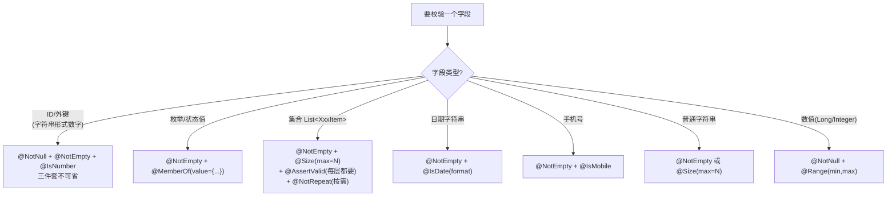
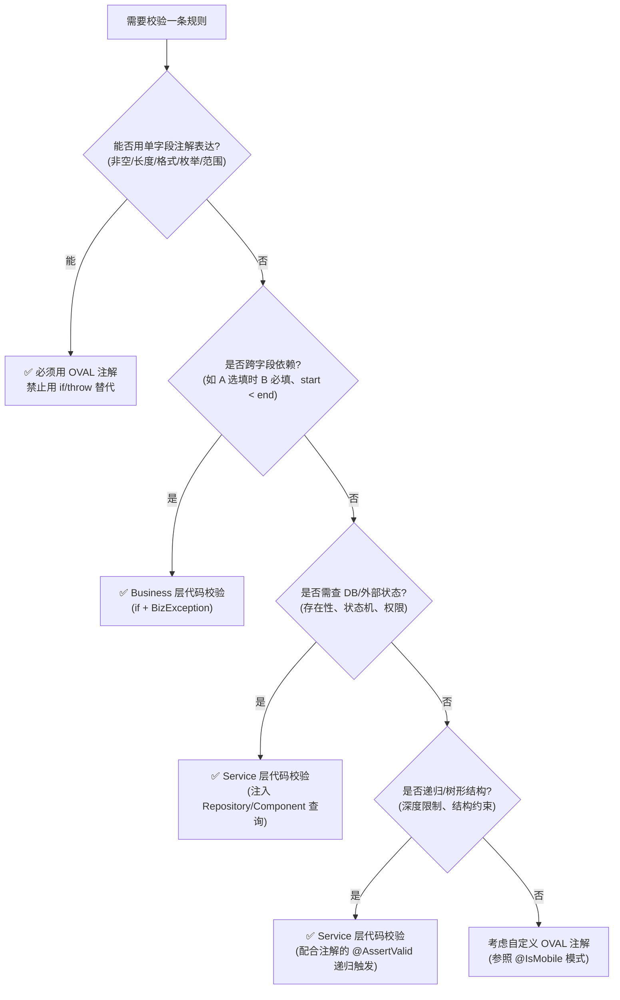

### OVAL 数据校验规范

#### 概述

入参校验分两层:**字段格式/取值完整性**由 OVAL 注解保证(声明式,Controller 入口自动触发);**跨字段/跨实体的业务规则**由代码校验承担(命令式,位于 Business/Service 层)。判定走注解还是代码,见 §2 决策树。

---

#### 1. 注解速查

> 按字段类型选注解,详见 §2 决策树。**表外字段类型不要自行引入 Hibernate Validator 风格注解**(如 `@NotBlank`/`@Pattern`/`@Email`/`@AssertTrue`),本项目仅使用以下两包。

**OVAL 原生注解(`net.sf.oval.constraint.*`):**

| 注解 | 作用 | 示例 |
| :--- | :--- | :--- |
| `@NotNull` | 非 null | `@NotNull(message = "ID不能为空")` |
| `@NotEmpty` | 非空且非空串 | `@NotEmpty(message = "名称不能为空")` |
| `@Size` | 长度/数量范围 | `@Size(max = 50, message = "最多50条")` |
| `@Range` | 数值范围 | `@Range(min = 1, max = 100, message = "数值超出范围")` |
| `@MemberOf` | 枚举值校验 | `@MemberOf(value = {"A", "B"}, message = "取值非法")` |
| `@AssertValid` | 触发嵌套对象校验 | 用于 `List<XxxItem>` 字段,见 §3 |

**业务扩展注解(示例框架 base 包 `com.example.base.oval.annotations.*`,替换为你项目的对应物):**

| 注解 | 作用 |
| :--- | :--- |
| `@IsNumber` | 验证字符串为纯数字 |
| `@IsDate` | 日期格式校验 |
| `@IsMobile` | 手机号格式校验 |
| `@NotRepeat` | 集合元素去重 |

---

#### 2. 校验决策树(编码前必读)

##### 2.1 决策树 1:字段 → 注解(按字段类型推理)



##### 2.2 决策树 2:注解 vs 代码校验



**强制条款:**
- 决策树 1 覆盖的所有场景,**禁止**用 `if (StrUtil.isBlank(...)) throw new BizException(...)` 替代注解
- 仅决策树 2 的 Q2/Q3/Q4 分支允许代码校验,且必须位于 Business/Service 层(**禁止**出现在 Controller)

---

#### 3. 嵌套校验强制规则

> **【强制】** 多层嵌套 Req 中,**每一层** `List<XxxItem>` / `List<XxxNode>` 字段都必须加 `@AssertValid`,profiles 与外层保持一致。
>
> **漏加一层的后果**:该层 item 内部字段全部跳过校验,等同于对该层入参完全不设防。

**正例锚点**:`V1GoodsCategoryTreeNodeReq`(递归 5 级分类树)在 `children`(`:89-90`)和 `memberList`(`:108-109`)两个字段都正确加了 `@AssertValid` + 4 个 profile。完整路径:`hr-client/src/main/java/com/example/hr/client/dto/goods/req/V1GoodsCategoryTreeNodeReq.java`。新建嵌套结构 Req 时参照此模式。

**典型集合字段写法(参考上述文件 `:89-109`):**

```java
@NotEmpty(message = "列表不能为空", profiles = {"goodsSave"})
@Size(max = 50, message = "最多50条", profiles = {"goodsSave"})
@AssertValid(profiles = {"goodsSave"})      // 每一层 List<XxxItem> 都要加
@NotRepeat(message = "元素不能重复", profiles = {"goodsSave"})  // 需要时添加
private List<XxxItem> itemList;
```

---

#### 4. 分组校验规则

- **profile 命名必须带业务语义前缀**(如 `goodsSave`/`goodsNameCheck`),禁止裸通用名(`save`/`add`/`edit`)——通用名在共享 Req(如 `V1FileUploadReq`)上极易撞名,导致无关业务的校验被意外激活或漏激活(2026-09-09 拍板)
- `@Validate("分组名")` 的值必须与 Req 注解的 `profiles` 完全一致;不再要求与 Controller 方法名字面相等(方法名保持最简语义,如 `save`)
- 同一字段在多个分组复用时,`profiles` 同时列出:`profiles = {"goodsSave", "goodsEdit"}`
- **共享 Req 类**(多业务域嵌套复用,如 `V1FileUploadReq`)**禁止无 profile 的裸注解**——裸注解全 profile 生效,影响面不可控;每个注解必须显式列出其生效的 profile 集合
- **新增业务分组时**,必须检查嵌套引用的共享 Req,把新 profile 补挂到其内部注解上,否则级联校验(`@AssertValid` 触发的长度/格式限制)会静默丢失

---

#### 5. 检查清单

**字段层:**
- [ ] 所有 ID 字段同时使用 `@NotNull + @NotEmpty + @IsNumber`,profiles 与 `@Validate` 分组名一致
- [ ] 所有 `List<XxxItem>` 字段都加了 `@AssertValid`(**每一层都要加**,不止顶层)
- [ ] 所有枚举字段使用 `@MemberOf`,未出现裸 String 字段
- [ ] 所有日期/手机号字段使用对应业务扩展注解

**逻辑层(注解 vs 代码):**
- [ ] 简单格式/取值校验全部走决策树 1,未出现 `if (isBlank) throw` 替代注解
- [ ] 代码校验仅出现在决策树 2 的 Q2/Q3/Q4 分支(跨字段、查 DB、递归结构)
- [ ] 代码校验位于 Business/Service 层,未出现在 Controller

**消息层:**
- [ ] 错误消息统一中文,格式为 `字段名 + 错误描述`

**分组层:**
- [ ] profile 名带业务语义前缀,未出现裸通用名(save/add/edit)
- [ ] 共享 Req 类中无裸注解,每个注解显式列出 profiles
- [ ] 新增分组已补挂到嵌套共享 Req 的内部注解(级联校验不缺失)
- [ ] `@Validate` 值与 Req 的 `profiles` 完全一致
