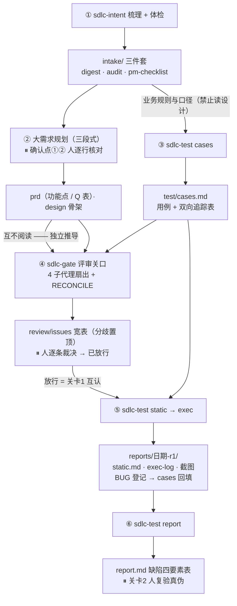

# 一个需求的一生：产物走查

> 所有片段取自一个真实大需求的全链路产物（2026-09），业务信息已虚构化为「区域评选活动」示例，**数字、表格格式与工作流痕迹原样保留**——看一眼每个关口产物长什么样，比读十段文字描述更快建立心智。

需求：区域评选活动管理（管理员五步向导创建/修改/终止/删除活动，多角色报名投稿，可配置的三级审核，专家评分，颁奖公示）。

六步走查的产物流转（⚠ 菱形 = 人工关口；实线 = 产物被下游消费）：



---

## 步骤 1：需求梳理 + 体检（sdlc-intent）

## 步骤 1：需求梳理 + 体检（sdlc-intent）

产出 `sdlc/<需求名>/intake/` 三件套。digest 头部长这样（注意评论区必读与版本锚点）：

```markdown
# 区域评选活动 需求梳理
> 来源：<飞书文档链接> ｜ 版本：v1.0.0（修订记录仅此一条；评论区讨论持续至 09-07）
> ｜ 评论区：已读取，共 24 条（含定论 8 条） ｜ 梳理日期：09-07
> 附注1：评论区引用的文句在当前正文中已改为新口径；两者不一致处以评论区定论标注。
> 附注2：正文内嵌可交互 demo 已读取并入本文档；demo 略滞后于正文，冲突处优先正文。

## 1. 概述
**一句话**：将区域评选活动全流程线上化——创建、报名投稿、可配置的三级审核、
专家评分、一键颁奖到赛果公示的一站式管理。
```

体检发现的缺陷走 **audit**（六层维度分级报告），待 PM 澄清的问题走 **pm-checklist**——🔴 级不澄清无法开始技术设计：

```markdown
## 🔴 必须确认（6 问）——共 30 问（🔴6/🟡14/🔵10）· 5 个主题

| # | 问题 | 答复 |
|---|---|---|
| 1 | 详述写分配规则「从专家库选取」，但全文没有「专家库」的定义。
      专家库就是创建活动第五步选好的「评审专家组」吗？ | ✅ 是（09-07 答复） |
| 4 | 状态机里进入「公示赛果」都要「环节时间结束 && 确认颁奖」。
      如果环节时间到了但管理员一直没颁奖，活动状态停在哪里？
      （评论区讨论过但没结论） | 展示评审中，公示开始后才能执行颁奖 |
```

## 步骤 2：大需求规划（三段式，[parent→child 自顶向下拆分](large-req-playbook.md)）

功能点 ≥5 且涉及表结构变更 → 触发三段式。第一段产物按 [stage1 模板](../templates/large-req-stage1-template.md) 填充，两个关键机制的样子——未决口径进 **Q 表**（带阻塞范围，只锁对应功能点）、体检问题必须有**去向**：

```markdown
## 6. 待确认项（Q 表）
| 编号 | 问题 | 当前假设 | 阻塞范围 |
|---|---|---|---|
| Q1 | 删除条件的三情形口径 | 未开始/已终止且无人报名可删 | 阻塞 F07（删除），不影响其余功能点 |

## 6.5 体检问题去向（audit 🔴/🟡 全部须有行，无行即确认点①不通过）
| 体检编号 | 级 | 去向 | 落点 | 说明 |
|---|---|---|---|---|
| 体检.P04 | 🔴 | 已承接 | 功能.F07 | PM 答复：公示开始后才能执行颁奖 |
| 体检.P11 | 🔴 | 转 Q 表 | 确认.Q6 | 来源待定，走 Q 表硬阻塞规则 |
```

## 步骤 3：设计与用例并行独立产出（互不阅读）

用例文件 `test/cases.md` 头部即「当前状态快照」——关卡状态、阶段进度、口径备注全部持久化在文件里，跨会话可恢复：

```markdown
# 区域评选活动 测试用例（范围：活动创建/编辑/终止/删除/查询）
> 口径备注：
> - 删除条件按假设 A10 三情形口径，对应 PM 清单 #18 未答复，待 PM 复核
> - **r1 评审修订**（issue 清单见 ../review/issues-20260910.md）：
>   ①TC-01/11 按拍板改为「全部参与方也落全量快照行」（D-01）；
>   ②新增 G 组 TC-69~74（时间轮生命周期、锁定矩阵接口级、编辑重名…）
> - **落库断言口径**：状态/枚举断言一律「中文描述（code）」双写

## 头部元数据
- 审核状态：已确认（09-10，sdlc-gate r1 裁决后放行）
- 阶段进度：
  - [x] 阶段1 用例生成
  - [x] 🔒 关卡1 用例审核（sdlc-gate r1 已放行）
  - [x] 阶段2 静态代码检测（R1：⚠️5 条/❓3 条，2 条前端未开发阻塞阶段3）
  - [ ] 阶段3 前端功能测试（进度：32/74，其中 9 条 ⏸ 暂缓待后续模块）
  - [ ] 阶段4 报告生成
  - [ ] 🔒 关卡2 报告复验
```

## 步骤 4：评审关口（sdlc-gate）

4 个全新上下文子代理预审后 RECONCILE 过滤，产出 `review/issues-<日期>.md` 宽表。头部是元数据 + 统计 + 裁决焦点（三类分歧与全部高严重度逐条列出，扫表即重点）：

```markdown
| 评审状态 | 已放行（09-10） |
| 用例文件 | sdlc/区域评选活动/test/cases.md（74 TC，含评审修订） |
| 独立性 | 破坏：用例生成时读过设计并对齐终稿，交叉按一致性检查降级 |
| 裁决计数 | 落改 41 ｜ 权衡记档 15 ｜ 驳回 1 ｜ 存疑 0 |

### 统计：分歧 12（一 9·二 2·三 1）｜ 架构 11 ｜ 数据 11 ｜ 可测性 23 ｜ 合计 57

### 裁决焦点（三类分歧 + 全部高严重度，共 12 条）
| 编号 | 标题 | 建议动作 |
|---|---|---|
| D-01 ⚠️三类 | 参与方快照口径：用例仍断言已作废的「全部参与方=无行」 | 确认拍板后落改用例 |
| D-02 | 时间轮生命周期零用例覆盖 | 补 2 条用例 |
| S-01 | 评分明细表实体已建但 schema 无建表语句 | schema 补建表 |
```

分歧明细每行带「设计说 / 用例说」双列原文摘引 + 裁决列——裁决结果必须落在明细行上，批量组吞条目正是靠这条规则防住的：

```markdown
| 编号 | 问题标题 | 设计说（原文摘引） | 用例说（原文摘引） | 建议 | 裁决｜理由 |
|---|---|---|---|---|---|
| D-01 | 参与方快照口径：用例仍断言已作废口径 | 全部/指定参与方均落全量快照行（09-08 拍板） | TC-01 落库「无 scope 行」 | 升级用户确认后落改 | 落改（快照口径修订+ER 加作废标记）｜按拍板 |
```

## 步骤 5：静态检测与浏览器执行（sdlc-test static → exec）

static 产出的 ⚠️ 疑似偏差自动写入用例文件「重点验证项」，exec 优先执行：

```markdown
## 重点验证项（R1 静态检测同步）
| 编号 | 端 | 验证点 | 关联用例 | 优先级 |
|---|---|---|---|---|
| 静态-01 | 后端 | 日期入参实际粒度为秒级（日粒度字符串过不了校验） | TC-09 | 高 |
| 静态-04 | 前后端 | 用户端活动广场前后端均未实现 | TC-55~57 | 阻塞 |
```

exec 逐用例「操作 → 等待稳定 → 页面/接口/落库/console 四类证据 → 判定 → 立即回填」，执行日志与缺陷跟踪双写；口径冲突按三去向处理（实现偏离=BUG / 需求未定=转 Q / 用例写错=修用例留档），禁止静默按实现校正。

## 步骤 6：报告与关卡2（sdlc-test report）

报告缺陷表四要素齐全、直接可复现，人复验真伪后才转达开发：

```markdown
| # | 用例 | 严重度 | 预期 | 实际 | 疑似代码位置 | 证据 | 状态 |
|---|---|---|---|---|---|---|---|
| BUG-1 | TC-01 | 高 | 全部参与方落全量快照行 | 仅 1 行 | ActivityServiceImpl.java:120 | TC-01-01.png | 待修复 |
```

---

## 产物目录总览

```
sdlc/
├── env/                          # 环境配置层（test.md/ui-recipe.md 入库；账号等 *.local.md gitignore）
└── 区域评选活动/                  # 一需求一目录
    ├── intake/                   # digest / audit / pm-checklist（sdlc-intent 产出）
    ├── review/                   # issues-<日期>.md（sdlc-gate 产出）
    ├── test/                     # cases.md（用例+缺陷跟踪权威文件）+ reports/<日期>-r<N>/（sdlc-test 产出）
    └── dev/                      # 轻量设计方案（可选）
```

配套阅读：[workflow.md](workflow.md)（全流程方法论）｜ [large-req-playbook.md](large-req-playbook.md)（大需求拆分规则）
