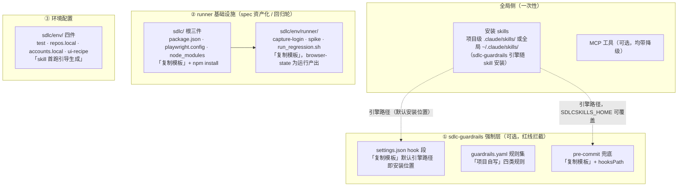

# 项目侧接入指南（装完 skill 之后配什么）

> **这份文档是什么**：skill 装好只是开始——guardrails 红线拦截、回归 runner、测试环境文件都在项目侧。本文给出「每个文件配在哪、怎么来的（复制模板 / 按约定自写 / skill 首跑引导生成）、干什么用」的全景清单。方法论源项目（某 Java DDD 系统）即按此清单接入。
> **和另两份的关系**：[sdlc-workflow-landscape.md](design/sdlc-workflow-landscape.md) 讲资产为什么分层（理念），[sdlc-guardrails/README.md](../skills/sdlc-guardrails/README.md) 讲引擎三步接入（细节），本文讲「一个新项目从零到全功能的操作地图」（清单）。

## 目录

- [0. 前置：全局侧（一次性）](#0-前置全局侧一次性)
- [1. sdlc-guardrails 强制层（可选，红线拦截）](#1-sdlc-guardrails-强制层可选红线拦截)
- [2. runner 基础设施（spec 资产化 + 回归轮）](#2-runner-基础设施spec-资产化--回归轮)
- [3. 环境配置（sdlc/env/，skill 首跑引导生成）](#3-环境配置sdlcenv-skill-首跑引导生成)
- [4. 最小配置阶梯（按需逐级上）](#4-最小配置阶梯按需逐级上)
- [5. 已知边界](#5-已知边界)

## 配置全景一图流



①②③ 三层相互独立、按需逐级上（见第 4 节阶梯）；引号内为该文件的来源。

---

## 0. 前置：全局侧（一次性）

| 项 | 怎么来 | 说明 |
|---|---|---|
| 安装 skills | `npx skills add TsCarpe/claude-sdlc-skills`（项目级 `.claude/skills/`）或 `-g`（全局 `~/.claude/skills/`） | 两种位置都行；sdlc-guardrails 引擎随 skill 一并安装，项目侧 hook 直接引用安装位置，**无需 clone 本仓库** |
| MCP 工具（全部可选） | chrome-devtools / mysql / codegraph / YApi / lark-cli | 每个 skill 对外部依赖都声明了降级路径，缺了不炸（[降级矩阵](faq.md)） |

## 1. sdlc-guardrails 强制层（可选，红线拦截）

红线拦截三档（入口守卫 / 写入拦截 / 提交兜底）中的后两档落在项目侧，共三个文件：

| 项目侧文件 | 怎么来的 | 作用 |
|---|---|---|
| `.claude/settings.json` 的 `PostToolUse` hooks 段 | **复制** [`skills/sdlc-guardrails/templates/settings-hook.json`](../skills/sdlc-guardrails/templates/settings-hook.json)，默认引擎路径即全局安装位置（`~/.claude/skills/sdlc-guardrails/engine/check.py`，通常无需改；clone 仓库使用者改为 checkout 内绝对路径），合并进项目已有 hooks | Write/Edit 写文件瞬间调 `check.py` 拦红线（子代理写入同样拦） |
| `.claude/guardrails.yaml` | **项目自写**：从项目规范里挑「可 grep 机械化」的条目翻译成四类规则（forbid / require / require_if / count_ge）；写法参考 [`sdlc-guardrails/references/guardrails.example.yaml`](../skills/sdlc-guardrails/references/guardrails.example.yaml)（23 条示例） | 规则集。知识层（怎么写对）留在项目规范文档，本文件只拦「写了就是错」 |
| `.githooks/pre-commit` | **复制** [`skills/sdlc-guardrails/templates/pre-commit`](../skills/sdlc-guardrails/templates/pre-commit)，执行一次 `git config core.hooksPath .githooks` | git commit 兜底（不经 Claude 的提交也拦）；引擎路径可用 `SDLCSKILLS_HOME` 环境变量覆盖，引擎缺失时警告放行（不阻塞未接入的同事） |

三步接入的完整细节（含 pipe-test 实测拦截）见 [sdlc-guardrails/README.md](../skills/sdlc-guardrails/README.md)。

## 2. runner 基础设施（spec 资产化 + 回归轮）

sdlc-test 的 spec 资产化与回归轮依赖一套 Playwright runner，全部落在项目侧 `sdlc/` 目录：

```text
<项目根>/sdlc/
├── package.json          ← 复制 skills/sdlc-test/templates/runner/package.json
├── playwright.config.ts  ← 复制 skills/sdlc-test/templates/runner/playwright.config.ts（baseURL 按项目替换）
├── node_modules/         ← 在 sdlc/ 根执行 npm install（位置红线，见下）
└── env/runner/
    ├── capture-login.mjs     ← 复制 skills/sdlc-test/templates/runner/capture-login.mjs（3 处占位符按项目替换）
    ├── spike.spec.ts         ← 复制 skills/sdlc-test/templates/runner/spike.spec.ts（3 处占位符按项目替换）
    ├── browser-state.json    ← 运行 node capture-login.mjs 产出（SSO 登录态，gitignore）
    ├── run_regression.sh     ← 复制 skills/sdlc-test/templates/run_regression.sh（一键回归，不占轮次号）
    └── test-results/         ← runner 运行产出（失败留痕，可随时清）
```

要点（接入操作表——模板 → 落位 → 占位符 → 就绪判据——随 sdlc-test skill 分发，见其 `references/env-template.md`「回归档 runner」节；依据与坑的完整记录见 skill 的 `references/spec/spec-guide.md`「runner 标准布局」）：

- **依赖必须装在 sdlc 根**：装在 `env/runner/` 子目录时 specs 的模块解析会命中项目根另一份 `@playwright/test` → 双树冲突（实测踩坑）
- `channel:'chrome'` 走系统 Chrome，零下载、不碰日常浏览器会话
- 模板里的占位符（`<app>`、`<list-api>`、鉴权键特征等）按项目实际替换；spike 冒烟通过 = runner 基础设施就绪
- 项目 `.gitignore` 建议三条：`sdlc/env/*.local.md`、`sdlc/env/runner/browser-state.json`（含会话凭据）、`sdlc/env/runner/test-results/`

## 3. 环境配置（sdlc/env/，skill 首跑引导生成）

这层**不需要预先手写**——sdlc-test 首次执行对应阶段时，skill 会按 [env-template.md](../skills/sdlc-test/references/env-template.md) 模板引导创建，此处只列清单：

| 文件 | 何时生成 | 内容 |
|---|---|---|
| `sdlc/env/test.md` | exec 首跑引导（入库） | 环境说明：URL / 登录方式 / 角色 / 前置数据 / 数据核验入口 |
| `sdlc/env/repos.local.md` | static 首跑引导（gitignore） | 前后端仓库本地路径与索引状态 |
| `sdlc/env/accounts.local.md` | exec 首跑引导（gitignore） | 角色 → 账号密码 |
| `sdlc/env/ui-recipe.md` | exec 首条用例侦察后沉淀（入库） | 项目特有 UI 配方：路由清单 / 环境检查恢复动作 / 鉴权直调头 / 项目特有坑；跨需求复用，持续增量回写 |

## 4. 最小配置阶梯（按需逐级上）

| 想跑什么 | 项目侧需要的配置 |
|---|---|
| sdlc-intent / sdlc-doubt / sdlc-config-review | **零配置**，装 skill 即用 |
| sdlc-test cases | 零硬配置（YApi / lark-cli 为可选增强） |
| sdlc-test static | `sdlc/env/repos.local.md` + codegraph / mysql MCP |
| sdlc-test exec | `sdlc/env/` 四份环境文件 + chrome-devtools MCP |
| spec 资产化 + 回归轮 | 第 2 节 runner 全套 |
| 红线强制拦截 | 第 1 节 sdlc-guardrails 全套 |

两层（sdlc-guardrails 与 runner）相互独立：只上测试不上拦截、或反之，都成立。

## 5. 已知边界

- **引擎路径是本机绝对路径**（hook 段模板的既有形态）：换机器要改 `ENGINE_PATH`；pre-commit 档可用 `SDLCSKILLS_HOME` 环境变量统一覆盖
- **`.claude/` 与 `sdlc/env/` 本地文件是否入库是项目自选**：源项目选择 gitignore（引擎路径个人化 + 账号/登录态敏感），代价是换机器或新同事要重配第 1、2 节
- runner 模板从源项目实测脚本脱敏收录（2026-09-14 试点定型），占位符替换工作量集中在 `capture-login.mjs` 的登录判定条件与 `spike.spec.ts` 的目标页锚点
