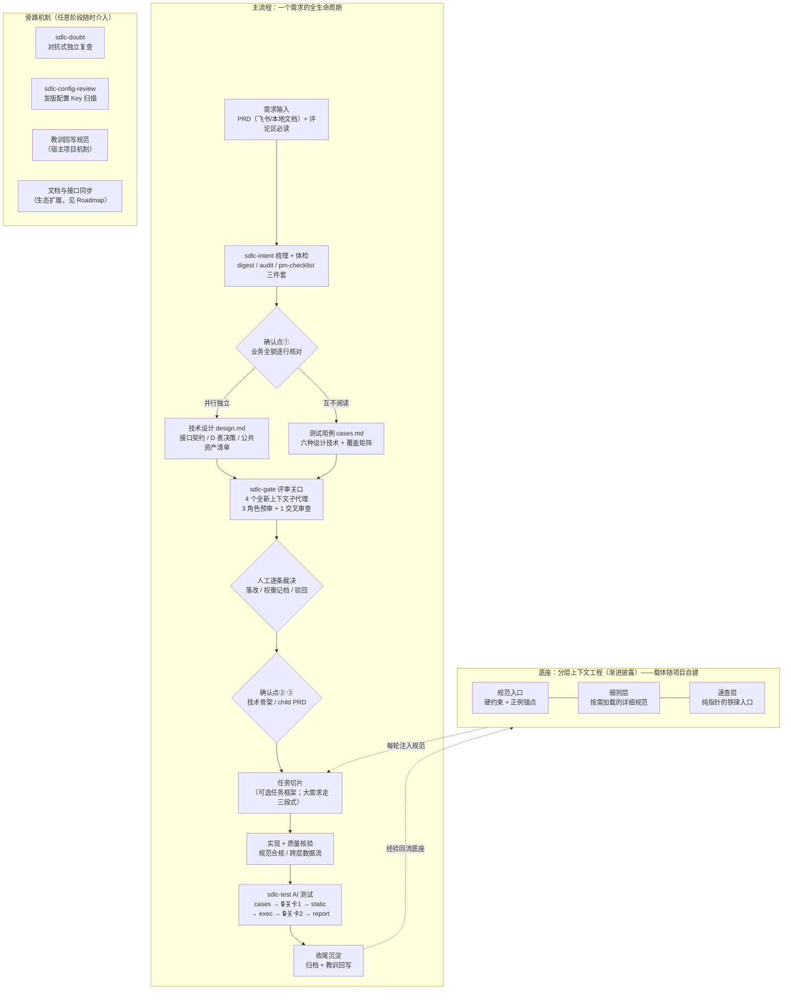
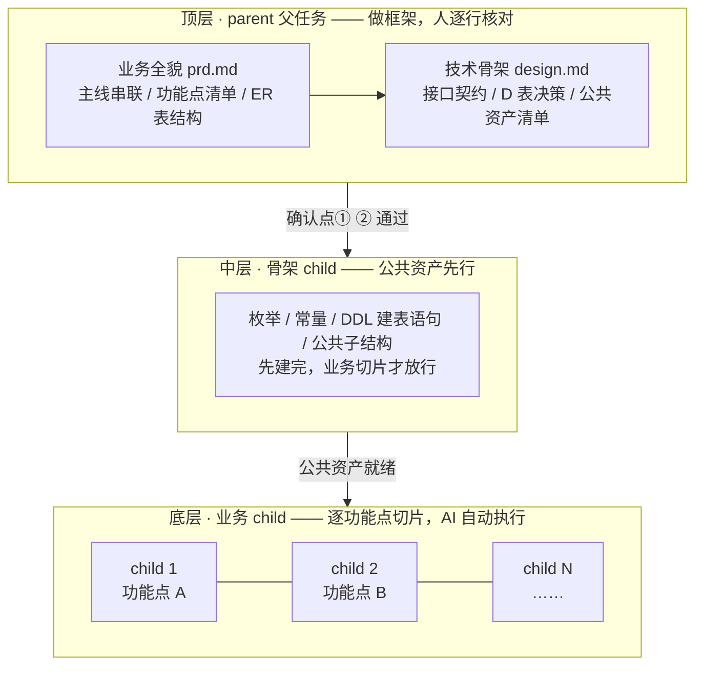

# 一人 + 一群 AI：AI 原生 SDLC 工作流全解

> 一套在真实 Java 项目跑通的 AI 原生 SDLC（软件开发生命周期）工作流：AI 承担梳理、设计、用例、编码、测试的重复劳动，人只在关键关口裁决。本文是完整方法论叙述；可安装的技能见仓库 [skills/](../skills/)，大需求拆分模板见 [templates/](../templates/)。

- **载体**：某 Java DDD 分层业务系统（Spring Boot + MyBatis Plus，Maven 多模块，多人协作）
- **工具面**：Claude Code 主驾驶 + 任务框架（可选）+ CodeGraph/只读 MySQL 等 MCP（模型上下文协议，让 AI 调用外部工具）
- **人的习惯**：逐接口切片——先出「入参/出参/逻辑」方案，人确认再写码；多方案不让 AI 自行决策

---

## 1. 全景：一个需求怎么走完一生

- 菱形节点全是人：AI 自动推进，人只在关口裁决；设计与用例互不阅读，是评审关口分歧信号的前提。
- 底座每轮生效：规范经 hook（生命周期钩子）或任务级上下文清单注入执行 AI 的上下文——写码的子代理看不到规范，等于没有规范。
- 大需求（涉及表结构变更 / 跨业务域 / 功能点 ≥5）不整块开发，走[三段式自顶向下拆分](large-req-playbook.md)。

## 2. 大需求拆解：三层金字塔

大需求（涉及表结构变更 / 跨业务域 / 功能点 ≥5，满足任一即触发）不整块开发，而是拆成三层金字塔：**上层 parent（父任务）做框架，底层拆成 child（子任务）切片执行**。

- **上层只做框架**：业务口径、接口契约、D 表（关键实现决策表，八类别必答）、公共资产在人能逐行核对的粒度上定死（确认点①②）；底层切片因此免现场设计——child 只做「内联 + 裁剪」，一半内容在现设计即说明上层缺项
- **骨架 child 先行**：枚举、常量、DDL（数据库建表语句）、公共子结构先建一次，业务 child 只消费不重建，防多切片重复建设与命名漂移
- **偏差分级回写**：局部偏差在 child 内改掉不回写；只有影响 ER（实体关系，即表结构）、接口契约、公共资产的偏差才回写 parent，且仅重审受影响的切片
- **横切功能点不单独建 child**：如定时状态流转这类无独立触发角色的功能，随宿主切片交付，事后按核验矩阵逐行补验

三段式完整规则与产物模板：[large-req-playbook.md](large-req-playbook.md) + [templates/](../templates/)。

## 3. 阶段拆解：工具、关口与产物

| 阶段 | 工具与关口 | 人工确认点 | 产物 |
|---|---|---|---|
| 1. 接收与梳理体检 | sdlc-intent：梳理（含流程图/状态机）→ 六层体检；评论区必读 | 梳理产物落盘后暂停 | req/ 三件套：digest（需求摘要）/ audit（缺陷体检报告）/ pm-checklist（待 PM 澄清清单） |
| 2. 规划（金字塔顶层） | 业务主线串联（角色×状态×功能点）→ 功能点从主线推导 → ER 后置；Q 表硬阻塞 | **确认点①** 逐行核对 | parent prd.md + design.md 上半（ER） |
| 3. 评审（关口） | 技术设计与测试用例并行独立产出 → sdlc-gate 四子代理 + RECONCILE（对账过滤，剔除误报） | **逐条裁决**（分歧类必须人拍板）；**确认点②** D 表必答八类别齐套 | review/issues-日期.md（宽表含原文摘引+裁决列） |
| 4. 切片开发（金字塔中/底层） | 骨架 child 先行、child prd 内联瘦身；或轻量任务主会话直做 | **确认点③** child prd 评审后才开发 | child prd、代码变更 |
| 5. 质量核验 | 规范合规 / 跨层数据流 / 复用检查 | 🔴 问题人工介入 | 检查报告 |
| 6. AI 测试 | sdlc-test：cases → static（用例↔代码比对）→ exec（浏览器）→ report | **🔒关卡1** 用例审核；**🔒关卡2** 报告复验 | cases.md、reports/ |
| 7. 收尾沉淀 | 归档 + 教训回写判断 + 文档同步 | — | 归档任务、规范增量、文档 |

产物目录约定：每需求一目录 `sdlc/<需求名>/`（req / review / test / dev 四子目录），环境配置集中 `sdlc/env/`（账号等本机敏感文件 gitignore）。

## 4. 支撑资产：四层结构

> 标记含义：📦 = 本仓库发布｜🏠 = 宿主项目自建（此处为示例，读者可按同构思路搭建）。借鉴来源：skills=addyosmani/agent-skills｜bp=Claude 官方 best-practices｜playbook=AI-Native SDLC Playbook｜G/O=Google/OpenAI 文章｜自创=原创或深度改造

| 层 | 资产 | 一句话职责 | 标记 | 借鉴来源 |
|---|---|---|---|---|
| **上下文层** | 规范入口文档 | 硬约束 + 正例锚点；个人本地约束（不做推测性修改、依赖 API 来源序） | 🏠 | bp+G+自创 |
| | 细则文档库 | 详细执行层：分主题细则 + 自检清单，按需加载 | 🏠 | 自创 |
| **流程层** | 大需求三段式 | 业务全貌→技术骨架→骨架先行的自顶向下拆分 + 确认点①②③ | 📦 | 自创 |
| | 混合工作模式 | 轻量任务主会话直做、复杂任务分发子代理 | 🏠 | 自创 |
| | 人工确认点体系 | 确认点①②③ + 评审逐条裁决 + 测试两道关卡 | 📦 | playbook+O |
| **技能层** | sdlc-intent | 需求接收两段式：梳理 8 区块 → 六层缺陷体检 | 📦 | playbook+自创 |
| | sdlc-test | AI 测试四阶段编排，子命令独立可重跑 | 📦 | 自创 |
| | sdlc-gate | 评审关口：4 个全新上下文子代理互查设计与用例 | 📦 | 自创 |
| | sdlc-doubt | 非平凡决策剥离结论，交全新上下文审查者「找问题」 | 📦 | skills→D2 决策 |
| | sdlc-config-review | 发版前扫描 diff 提取三类配置 Key | 📦 | 自创 |
| **产物层** | sdlc/<需求名>/ | 每需求一目录：req 三件套 / review issues / test cases+reports | 📦（约定随 skill） | playbook+自创 |
| | 决策记录 / 开发日志 / 统一 ID 体系 | 决策 ADR / 日志 / 跨产物「命名空间.编号」引用不断链 | 🏠 | bp+自创 |

## 5. AI 与人的分工与平衡

| 环节 | AI 负责 | 人负责 |
|---|---|---|
| 需求梳理 | 产出摘要/体检/澄清三件套，评论区一并消化 | 确认梳理口径，答复澄清项 |
| 技术设计 | 接口契约、决策表、公共资产清单成稿 | 确认点①② 逐行核对清单 |
| 评审 | 4 个独立子代理互查、过滤误报、汇总 issue 宽表 | 逐条裁决；分歧类拍板（不得下放 AI） |
| 切片编码 | child 切片实现 + 规范自检 | 抽查关口产物；被锁口径拍板 |
| 质量核验 | 规范合规 / 跨层数据流 / 复用检查 | 🔴 问题裁决修复方向 |
| 测试 | 用例生成、静态比对、浏览器执行、报告 | 🔒关卡1 用例审核、🔒关卡2 报告复验 |
| 经验沉淀 | 提炼教训候选、草拟规范增量 | 决定是否固化为 spec 规则 |

平衡靠三条原则撑住：

- **关口粒度**：人只做 AI 做不好的判断（拍板、风险、口径取舍），且核对对象永远是逐行可对的清单，不是通读长文——人的注意力花在刀刃上
- **信任分级**：AI 结论必须证据可追溯；给不出出处的结论一律标注「未验证」，不得含糊带过
- **不阻塞推进**：未决口径只锁对应功能点（Q 表硬阻塞），人不在场时其余切片照常推进，回来只为被锁的几点拍板

## 6. 设计理念：借鉴了什么，为什么这样设计

### 6.1 四个来源的取舍

一句话总括：**G 答「为什么」，playbook 答「怎么做」，O 答「人怎么管」，skills 答「纪律怎么强制」**。

| 来源 | 核心洞察 | 吸收了什么 |
|---|---|---|
| skills addyosmani/agent-skills | AI 默认走最短路径，技能强制纪律 | 反合理化表、静默降级检测、证据可追溯 → 质量核验 / sdlc-doubt |
| bp 官方 best-practices | skill 工程硬规范 | 精瘦 SKILL.md、单一权威指针、evals（技能回归测试场景）固化回归 → 自建 skill 三轮复核 |
| playbook AI-Native SDLC | 工件链 +「没有可接受的计划不实现」 | intent→spec→plan → sdlc-intent 三件套 / 任务三件套 / 计划先行经批准再动手 |
| G+O 两篇文章 | 上下文工程、支撑层、委派/审查/负责 | 三层上下文分工、「AI 推进、人只在关口裁决」的分工观 |

演化是复盘驱动的，不是一次性设计：分层规范定型 → sdlc-intent → sdlc-test → 对照分析决策（D1-D7）→ sdlc-gate + 三段式重写 → 统一 ID 体系、试点跑通全链路。

### 6.2 四大核心机制

| 机制 | 解决什么问题 | 关键实践 |
|---|---|---|
| 分层上下文工程 | 执行 AI 上下文里没有规范 | 三层分工（入口/细则/速查）+ 任务级清单登记规范与代码锚点、拒绝空清单启动；「注入替代复制」防副本漂移 |
| 人工关口 | 一次大确认看不完、看不准 | 确认点核对的是逐行可对的清单而非通读；Q 表硬阻塞——未决口径只锁对应功能点，不阻塞全局 |
| 对抗式审查 | 单个 AI 自查会被自己的结论带偏 | sdlc-gate：设计与用例并行独立产出，4 个全新上下文（fresh-context，无历史会话记忆的独立 AI 实例）子代理互查，分歧类必须人拍板；sdlc-doubt：决策剥离结论再送审 |
| 规范回写闭环 | 同一个坑踩第二次 | 收尾必过「是否沉淀」判断：spec 规则 / checklist 项 / 决策记录；反复调试触发根因归类；skill 配套 evals |

## 7. 落地效果与复刻建议

### 7.1 试点数据

一个真实大需求（2026-09-10 全链路跑通）：

- sdlc-gate 首轮 **57 条 issue**（分歧 12 / 架构 11 / 数据 11 / 可测性 23）；裁决：落改 41 / 权衡记档 15 / 驳回 1
- 高价值发现均为人工评审易疲劳漏掉的对照类缺陷：用例仍断言已作废口径、时间轮与服务端强制零用例覆盖、schema 缺建表语句、设计与代码双重漂移
- 最终用例集 74 条 TC（测试用例）进入 AI 测试执行

### 7.2 真实教训

- 评审产物格式迭代三轮才到「一行一 issue + 原文摘引 + 重点分层」的平衡点
- 批量裁决曾漏执行一条——此后每条 issue 明细行必须有独立裁决结果 + 放行前落点闭环校验
- 用例读过设计则分歧信号基本消失——独立性是前提，降级需知情

### 7.3 复刻路径（按性价比排序，不必一步到位）

| 步骤 | 投入 | 产出 |
|---|---|---|
| ① 安装 sdlc-intent | 5 分钟 | 需求梳理+体检立即可用，零外部依赖 |
| ② 人工关口 | 观念转变 | 「AI 出方案→人裁决→再实现」制度化，关键是核对清单逐行可对 |
| ③ 评审关口 sdlc-gate | 1 天 | 设计+用例独立产出，扇出全新上下文子代理互查 |
| ④ 大需求三段式 | 半天上手 | 套用 templates/ 三模板 + playbook 规则 |
| ⑤ 测试编排 sdlc-test | 持续投入 | 需环境与工具面配套，建议 ①-④ 稳定后再上 |

> 彩蛋：本文档本身就是这套工作流的产物——探索（子代理调研）→ 计划（先出大纲、人确认口径）→ 成文，全程可追溯。

---

## 参考

- [addyosmani/agent-skills](https://github.com/addyosmani/agent-skills) ｜ [Claude Agent Skills 最佳实践](https://platform.claude.com/docs/zh-CN/agents-and-tools/agent-skills/best-practices) ｜ [AI-Native SDLC Playbook](https://academy.claude.com/zh-CN/courses/ai-native-sdlc-playbook)
- Google《The New SDLC With Vibe Coding》、OpenAI《构建 AI 原生工程团队》
- 本仓库配套：[large-req-playbook.md](large-req-playbook.md)（三段式规则）｜ [sdlc-test-design.md](sdlc-test-design.md)（AI 测试设计决策）｜ [example-walkthrough.md](example-walkthrough.md)（产物走查）
