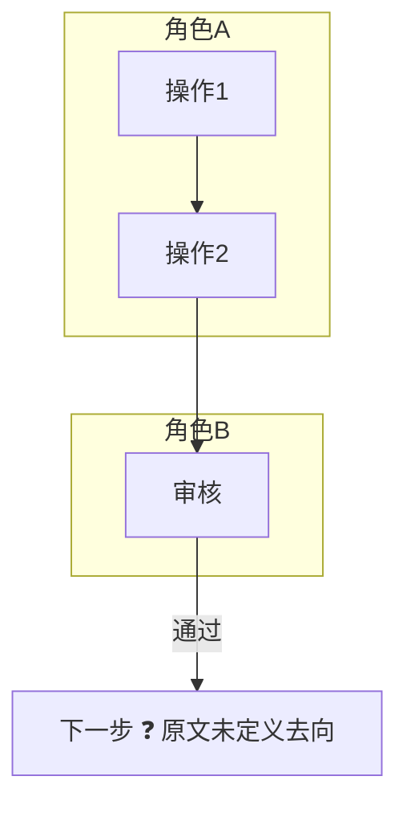
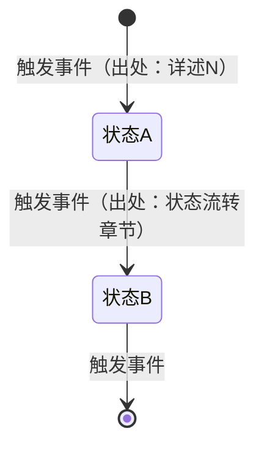

# 梳理文档模板（8 区块）

> 第一段「需求梳理」的输出模板。全部区块必须产出；原文没有内容的区块写「原文未提及」并保留区块标题，不要删除区块。
>
> **标注约定**：
> - ❓ = 原文缺失/未定义（禁止自行补全）
> - 引用格式：每张表尽量给出「出处」列（原文章节名），便于回溯
> - 评论区来源（正文的补充信息源，评论是更新的信息）：出处列写「评论区」，带锚点时写「评论区·『锚点文字』」（≤10 字，锚点取自评论的 quote 字段）。答复是否构成定论由回复链内容判断，不看评论的解决标记——回复中有明确结论性答复的可作为口径/规则提取，且与正文不一致时以评论为准（可标注「正文未同步」）；仅提问、讨论无结论的只能进假设清单；拿不准按假设清单处理
> - 附加小节（§9+ 增量说明等）的内部编号属文档内部结构，禁止被其他产物跨文件引用；确需引用时引章节号
> - v1.2（doc.json 存在时）：出处鼓励写到条款级——「详述N·<小节名>」或「详述N·<序数>」（如 详述6·步骤一 / 详述6·1.a.i，条款树用 scripts/list_clauses.py 查看）；推送前 resolve_anchors.py 据此附加块锚，平台可直达原文条款

---

## 目录（模板自身导航）

> 本目录是 digest-template.md 自身的导航（本文 >100 行，供部分读取时预览范围——agent-skills best practices 约定），**不是产物内容，禁止复制进产物**；产物自身结构见下节「产物骨架」。

- [文档头](#文档头)
- [区块 1：一句话概述 + 背景与目标](#区块-1一句话概述--背景与目标)
- [区块 2：角色与职责表](#区块-2角色与职责表)
- [区块 3：核心概念表](#区块-3核心概念表)
- [区块 4：功能点地图（矩阵表）](#区块-4功能点地图矩阵表)
- [区块 5：业务主流程图](#区块-5业务主流程图)
- [区块 6：状态机图](#区块-6状态机图)
- [区块 7：关键规则与口径表](#区块-7关键规则与口径表)
- [区块 8：假设清单](#区块-8假设清单)

## 产物骨架（顺序固定）

产物 = 文档头 → 目录 → 8 区块。产物目录紧跟文档头，**有序列表 + 锚点链接**，编号与章节号一致，仅列一级区块（区块内二级小节不进目录）；禁止「`- 1. xxx`」bullet 加数字双标记，禁止无链接纯文本目录：

```markdown
## 目录

1. [概述](#1-概述)
2. [角色与职责](#2-角色与职责)
3. [核心概念](#3-核心概念)
4. [功能点地图](#4-功能点地图)
5. [业务主流程图](#5-业务主流程图)
6. [状态机图](#6-状态机图)
7. [关键规则与口径](#7-关键规则与口径)
8. [假设清单](#8-假设清单)
```

锚点生成（GitHub 约定）：标题文本去标点（含全角括号/逗号等）、空格转连字符，如 `## 1. 概述` → `#1-概述`。

---

## 文档头

```markdown
# <需求名> 需求梳理

> 来源：<文档链接或文件路径> ｜ 版本：<原文修订号/日期> ｜ 评论区：<已读取，共 N 条（含定论 M 条）｜ 无评论 ｜ 未读取（原因）> ｜ 原型附件：<已读取（文件名，N 页面/M 弹窗）｜ 无 ｜ 未读取（原因）> ｜ 梳理日期：<YYYY-MM-DD>
> 说明：本文档为需求忠实转述，❓ 标记处为原文未定义内容，详见假设清单。
> ID 体系：本文件产出 需求.FR-xx（§7 规则表）、需求.A<编号>（§8 假设清单，实例 需求.A3）；其他产物引用本文条目须带命名空间前缀（如 需求.FR-03、需求.A3）
```

## 区块 1：一句话概述 + 背景与目标

```markdown
## 1. 概述

**一句话**：<这个需求要做一件什么事>

**背景**：<为什么做，2-3 句>

**目标**：<产品目标要点，原文条目化>
```

## 区块 2：角色与职责表

```markdown
## 2. 角色与职责

| 角色 | 职责 | 主要使用场景 | 出处 |
|---|---|---|---|
| 角色A | ... | ... | 角色与权限章节 |
```

注意：角色名以原文定义为准；正文出现但角色表未定义的角色，单独一行标注「❓ 正文出现，未在角色表中定义」。

## 区块 3：核心概念表

```markdown
## 3. 核心概念

| 术语 | 释义 | 出处 | 状态 |
|---|---|---|---|
| 术语A | ... | 关键词释义 | ✅已定义 / ❓被引用未定义 / ⚠️已定义未使用 |
```

状态列就是概念层的初步体检素材，但此阶段只标注不展开分析。

## 区块 4：功能点地图（矩阵表）

```markdown
## 4. 功能点地图

| 角色 | 页面/模块 | 功能 | 覆盖状态 | 出处 |
|---|---|---|---|---|
| 角色A | 页面X | 功能描述 | ✅有详述 / ⚠️仅清单 / ❌仅提及 | 详述N / 清单M / 附录 |
```

覆盖状态判定：✅ 有详细需求描述；⚠️ 只在功能清单出现；❌ 只在附录/关键词/其他章节顺带提及。对照附录页面清单逐项核对，附录有而正文无的页面全部列出。

完整性纪律：对正文「核心功能清单」逐行核对，每行必须有落点——收录进本表（含 ⚠️/❌）或标「范围外」（本次关注范围排除的，仍占一行写明）；清单子功能（列表页内弹窗、明细查看等）不单列时并入所属行的功能描述，禁止静默省略。

## 区块 5：业务主流程图

用 mermaid flowchart 呈现跨角色主流程，角色用 subgraph 泳道。原文流程断点标 ❓。



页面级操作流程（表单步骤、向导步骤）另用一张 flowchart，不必泳道化。

## 区块 6：状态机图

对原文中**每个**带状态的对象各画一张 `stateDiagram-v2`。每条流转须能在原文找到出处；原文未定义的流转不画，在图下方列 ❓ 清单。



图后附表：

```markdown
| 状态 | 进入条件 | 离开条件 | 出处 |
|---|---|---|---|
```

## 区块 7：关键规则与口径表

```markdown
## 7. 关键规则与口径

| 编号 | 规则/口径 | 数值/约束 | 出处 |
|---|---|---|---|
| FR-01 | 时限类 | 如：X 个工作日内完成 Y | 章节 |
| FR-02 | 分数/权重类 | 如：满分、制式、权重合计 | 章节 |
| FR-03 | 权限类 | 如：某数据仅某角色可见 | 章节 |
| FR-04 | 次数/上限类 | 如：重提次数、附件大小 | 章节 |
| FR-05 | 排序类 | 如：同分按时间先后 | 章节 |
```

编号纪律：FR-01 起连续编号、新增不重排（保证下游引用稳定）；下游产物（用例追踪表、静态检测、评审）引用规则条目统一写 `需求.FR-xx`。

## 区块 8：假设清单

```markdown
## 8. 假设清单

| 编号 | 原文位置 | 模糊点 | 类型 | 梳理时的理解 |
|---|---|---|---|---|
| A1 | 详述N 第x条 | ... | 推断 | 此处按 X 理解（因为原文…） |
| A2 | 详述M 第y条 | ... | 假设 | 此处按 Y 理解 |
```

编号 A1 起；外部产物引用假设条目须写 `需求.A<编号>`（如 需求.A3），族内（体检报告/PM 清单）可裸写 A3。

类型判定：能写出「因为原文 X 所以按 Y 理解」= **推断**（理解列保留该依据句）；写不出依据链 = **假设**（拍板待确认，问 PM 优先级应更高）。下游据此判断口径承重程度。

用户确认/补充后，逐条更新本清单（追加「结论」列），形成共识版。评论相关的模糊点，原文位置按「评论区·『…』」格式填写。
